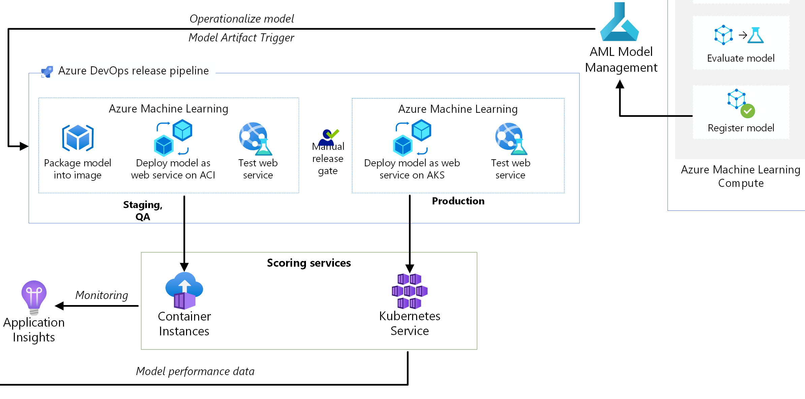
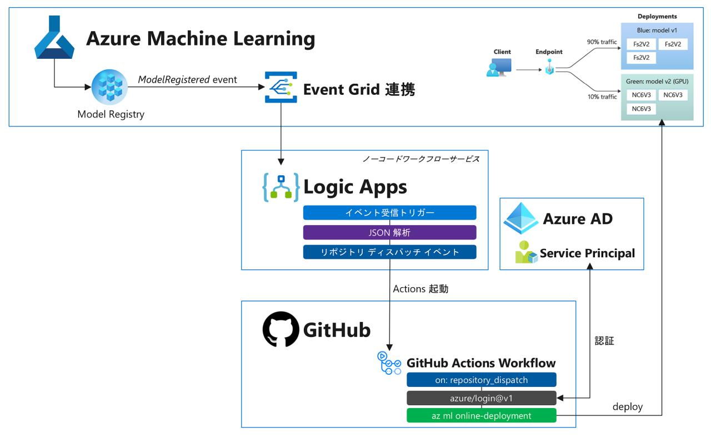

# Challenge 6 – デプロイパイプラインの作成とモデル登録トリガー

[< Previous Challenge](./Challenge-05.md) - **[Home](./README.md)** - [Next Challenge >](./Challenge-07.md)

## Introduction
機械学習パイプラインによるトレーニングの自動化によって、データサイエンティストは煩雑な作業が減り、より "ML" の部分に注力できるようになりました。しかしプロジェクトとしてはこれで終わりではありません。データサイエンティストが作成したモデルは検証環境から運用環境へとデプロイされ、継続的に運用していかなければなりません。デプロイされた推論環境は Web アプリケーションが使用するため、アプリケーションチームの使う CI/CD ツール連携も必要になります。

## Description
この [MLOps リファレンスアーキテクチャ](https://docs.microsoft.com/azure/architecture/reference-architectures/ai/mlops-python)は、エンジニアが既に慣れているツールを使用して、AI プロジェクトのさまざまな段階をエンドツーエンドで自動化する方法を示しています。リファレンスアーキテクチャの図から、今回のテーマとなるデプロイ（リリース）パイプラインの部分を取り出したのが以下の図になります。本演習ではシンプル化のため、検証環境と運用環境は 1 つのものとして扱い、Github Actions を使用してデプロイパイプラインを構築します。

 

本演習では、新しい成果物（モデル）が利用可能になるたびに、デプロイパイプラインがトリガーされる仕組みを実装します。Azure Machine Learning モデルレジストリに新しく登録されるモデルは、リリース成果物として扱われます。Azure Machine Learning と Event Grid との連携によって、以下の図のように Azure Machine Learning ワークスペース内で発生したイベントを外部イベントハンドラに送信することができます。

 

今回は **Logic Apps** を使用してモデル登録イベントを受け取り、イベントデータからモデル名とモデルバージョン番号を取り出して、Github Actions 上のデプロイパイプラインのパラメータとして送信します。

## Hack
### 1. Github Actions を使用したデプロイパイプライン構築
1. Azure CLI を使用してサービスプリンシパルを作成し、クレデンシャルをシークレットとして GitHub に保存します。
1. GitHub Actions で デプロイパイプラインの Workflow を作成します。必要なファイルは [Challenge 3](./Challenge-03.md) で作成したファイルを使います。
1. 作成した Workflow のトリガーは `on: repository_dispatch` [イベント](https://docs.github.com/rest/repos/repos#create-a-repository-dispatch-event) を使用して、外部から起動できるようにします。
 - **Github Actions 設定の全手順解説は[こちら](./Solutions/Solution-Challenge-06-1.md)を参照してください。**

### 2. Logic Apps によるモデル登録トリガーの作成
1. [Azure Portal](https://ms.portal.azure.com/) を開き Azure Machine Learning ワークスペースに移動し、Logic Apps 連携によるイベント受信トリガーを作成します。
1. Azure Machine Learning から送信される `ModelRegistered` イベントのデータは JSON 形式なので次のステップは「**JSON の解析**」アクションを作成します。
1. `ModelRegistered` イベントの JSON データから登録されたモデル名とモデルバージョン番号を取得し、それらの値をパイプラインエンドポイントのパラメータとして指定して「**リポジトリ ディスパッチ イベントを作成する**」アクションを作成します。
1. Azure Machine Learning でモデルを登録して動作を検証します。
 - **Logic Apps 設定の全手順解説は[こちら](./Solutions/Solution-Challenge-06-2.md)を参照してください。**

## 成功基準
- デプロイパイプラインをトレーニングパイプラインと分ける理由とメリットをコーチに説明します。
- Github Actions でデプロイパイプラインを構築する。
- Azure Machine Learning - Event Grid - Logic Apps 連携によってモデル登録トリガーでデプロイパイプラインが正常に起動できること。

 

## ヒント
 - [サービス プリンシパル シークレットで Azure ログイン アクションを使用する](https://docs.microsoft.com/azure/developer/github/connect-from-azure?tabs=azure-portal%2Clinux#use-the-azure-login-action-with-a-service-principal-secret)
 - [Github Actions: リポジトリ ディスパッチ イベントを作成する](https://docs.github.com/ja/rest/repos/repos#create-a-repository-dispatch-event)
 - [Azure Machine Learning イベントに基づいてアプリケーション、プロセス、または CI/CD ワークフローをトリガーする](https://docs.microsoft.com/azure/machine-learning/how-to-use-event-grid#example-send-email-alerts)

## 学習リソース
 - [GitHub Actions で開発タスクを自動化する方法](https://docs.microsoft.com/learn/modules/github-actions-automate-tasks/2-github-actions-automate-development-tasks)
 - [Github Actions: ワークフローについて](https://docs.github.com/actions/using-workflows/about-workflows)
 - [Logic Apps: JSON の解析アクション](https://docs.microsoft.com/azure/logic-apps/logic-apps-perform-data-operations#parse-json-action)
 - [Event Grid イベントスキーマ: ModelRegistered イベント](https://docs.microsoft.com/azure/event-grid/event-schema-machine-learning?tabs=event-grid-event-schema#example-events)
 - [Logic Apps: リポジトリ ディスパッチ イベントを作成する](https://docs.microsoft.com/connectors/github/#%E3%83%AA%E3%83%9D%E3%82%B8%E3%83%88%E3%83%AA-%E3%83%87%E3%82%A3%E3%82%B9%E3%83%91%E3%83%83%E3%83%81-%E3%82%A4%E3%83%99%E3%83%B3%E3%83%88%E3%82%92%E4%BD%9C%E6%88%90%E3%81%99%E3%82%8B-(%E3%83%97%E3%83%AC%E3%83%93%E3%83%A5%E3%83%BC))
