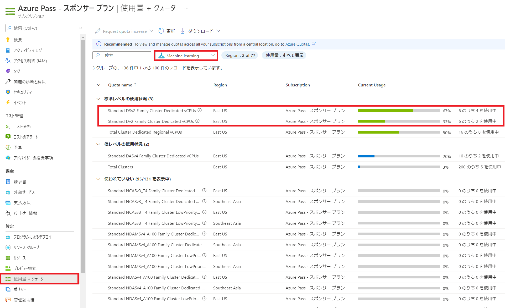

# Challenge 0. OpenHack for MLOps 事前確認手順解説
[< Back](../Challenge-00.md) - **[Home](../README.md)** 

本解説では、OpenHack for MLOps のチャレンジが問題なく進められるように事前に確認しておくべき確認項目をまとめています。 
特にサブスクリプションの制限に起因する問題が多いため事前に十分確認をお願いいたします。

事前に確認すべき項目は以下となります。
1. Azure Machine Learning リソースを作成できること
1. Azure Machine Learning コンピューティング インスタンスおよびコンピューティング クラスターを作成できること
1. Azure CLI を使用してサービスプリンシパルが作成できること
1. Azure LogicApps および Azure Event Grid リソースを作成できること
1. GitHub アカウントの作成
1. Azure DevOps の事前申請（オプション）
1. Visual Studio Code の準備（オプション）

## 手順
### 1. Azure Machine Learning リソースを作成できること

1. サブスクリプションが Azure Machine Learning リソースを作成できることを確認します。[こちらの手順](https://learn.microsoft.com/azure/machine-learning/quickstart-create-resources)にしたがって、ワークスペースが作成できることを確認してください。ワークスペースが作成できると、以下のリソースが自動的にデプロイされます。

    - Azure Machine Learning
    - Application Insights
    - KeyVault
    - Storage Account
    - Azure Container Registry(デプロイ時に自動作成)
    - Azure Container Instance(デプロイ時に自動作成)
1. もし作成できない場合、サブスクリプションのリソース プロバイダーで許可されてない可能性があります。[こちらの手順](https://learn.microsoft.com/azure/azure-resource-manager/management/resource-providers-and-types)にしたがって `Microsoft.MachineLearningServices` を `Registered` （登録済み）にしてください。

### 2. Azure Machine Learning コンピューティング インスタンスおよびコンピューティング クラスターを作成できること

1. Azure Machine Learning で使用する仮想マシンを正常に作成できるか確認します。[Azure Portal](https://portal.azure.com/) から、「サブスクリプション」へ移動し左メニューから「使用量 + クォータ」を選択します。右ペインのドロップダウンで「**Machine Learning**」を選択し、以下のクォータに空きがあるかどうか確認します。以下の名前をコピーして検索ボックスに貼り付ければ検索できます

    - Standard Dv2 Family Cluster Dedicated vCPUs: 使用するリージョンで 2 つ以上の空き
    - Standard DSv2 Family Cluster Dedicated vCPUs: 使用するリージョンで 1 つ以上の空き

1. もし「0 のうち 0 を使用中」と表示されていた場合、クォータの増量をリクエストする必要があります。本演習では、以下のマシンを利用しますが、クォータに空きがあるマシンが他にあればそちらを使用しても構いません。

    - コンピューティング インスタンス/クラスター: Standard_D2_v2
    - マネージドオンラインエンドポイント: Standard_DS2_v2

### 3. Azure CLI を使用してサービスプリンシパルが作成できること

1. [こちらの手順](https://learn.microsoft.com/azure/active-directory/develop/howto-create-service-principal-portal#app-registration-app-objects-and-service-principals)にしたがって、アプリケーションを Azure AD テナントに登録し、Azure サブスクリプションでそのアプリケーションにロールを割り当てるために、十分なアクセス許可を持っているか確認します。

### 4. Azure LogicApps および Azure Event Grid リソースを作成できること
Azure サブスクリプションで 一度も LogicApps/Event Grid を使用したことがない場合は、リソース プロバイダーを登録する必要があります。[こちらの手順](https://learn.microsoft.com/azure/azure-resource-manager/management/resource-providers-and-types)にしたがって 以下のリソースを `Registered` （登録済み）にしてください。

  - `Microsoft.EventGrid`
  - `Microsoft.Web`

### 5. GitHub アカウントの作成
本演習ではパイプラインの構築に Github Actions を使用しますので、事前に Github アカウントをご用意ください。

1. [Github](https://github.com/) にアクセスします。
1. トップページの「Email Address」欄に使用するメールアドレスを入力し「Sign up for GitHub」ボタンをクリックします。
1. 「password」「username」「お知らせ受け取り可否」を順に入力します。
1. 「Verify」チェックを行った後「Create account」ボタンをクリックします。
1. メールアドレス宛に確認メールが飛ぶのでメール中のリンクをクリックするか、8 桁の認証コードを入力して登録完了です。

### 6. Azure DevOps の事前申請（オプション）
本演習では、パイプラインの構築に Github Actions をメインで使用しますが、もし組織の要件でパイプラインを Azure DevOps を用いて作成したい場合、以下のような制約がありますのでご注意ください。

> **重要: 無料アカウントもしくは Azure Pass で Azure DevOps を使用している場合、パイプライン実行時に[申請](https://learn.microsoft.com/azure/devops/release-notes/2021/sprint-184-update)が必要となり申請に 2~3 日かかります。すでにパイプラインが実行可能な方のみ選択してください。**

### 7. Visual Studio Code の準備（オプション）
すでに Visual Studio Code をお使いの方は [Visual Studio Code Azure Machine Learning 拡張機能](https://learn.microsoft.com/azure/machine-learning/how-to-setup-vs-code) をインストールすることで効率的にチャレンジを遂行できます。[こちら](https://learn.microsoft.com/azure/machine-learning/how-to-setup-vs-code)の手順から以下を完了してください。

1. 拡張機能をインストールする
1. Azure アカウントにサインインする
1. 既定のワークスペースを選択する
1. リモート コンピューティング インスタンスを構成する
1. コンピューティング インスタンスをリモート ノートブック サーバーとして構成する

> 注意: 本手順は、Visual Studio Code がすでにインストールされている方のみを対象としています。Visual Studio Code 本体のインストールは扱いません。

[< Back](../Challenge-00.md)