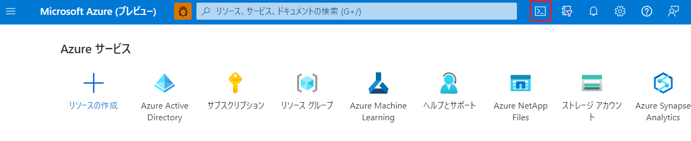
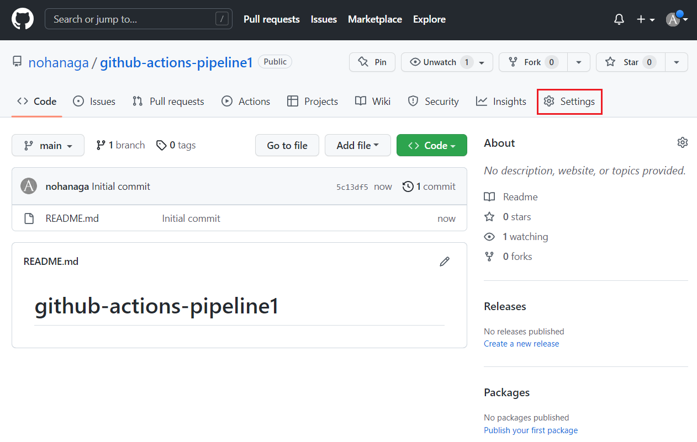
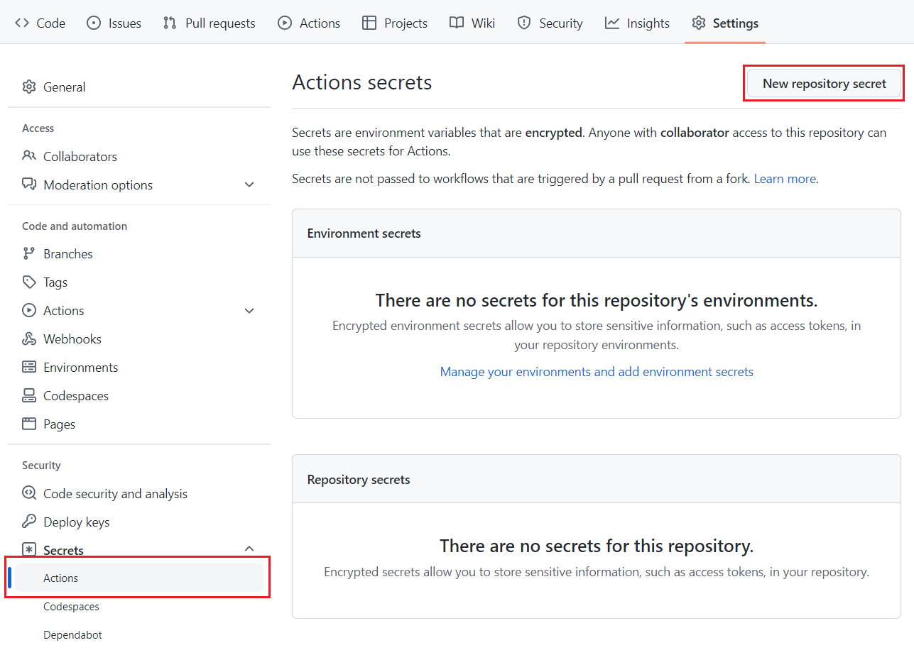
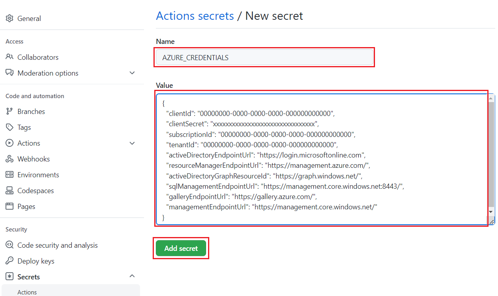
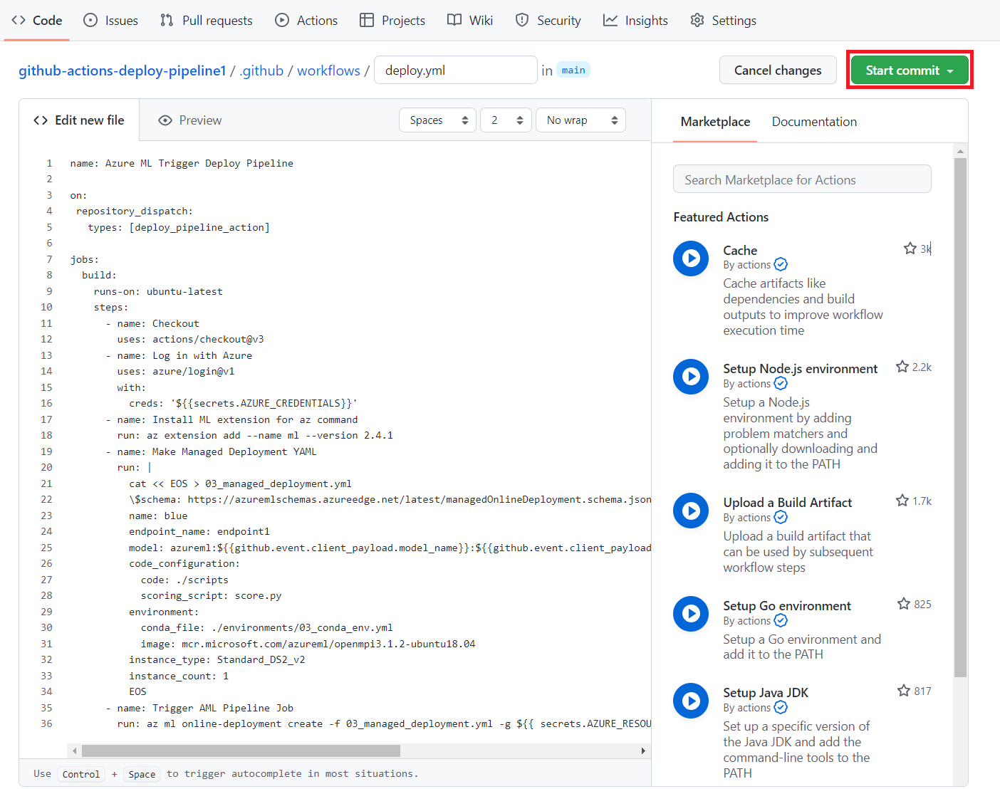
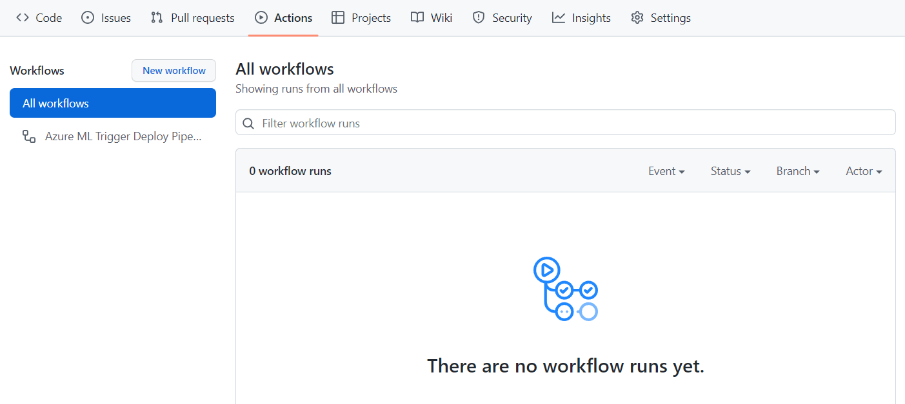

# Challenge 6 – 1. Github Actions デプロイパイプライン構築手順解説
[< Back](../Challenge-06.md) - **[Home](../README.md)** 

本解説では、[Challenge 6](../Challenge-06.md) の Github Actions を用いてデプロイパイプラインを構築し、Azure Machine Learning のエンドポイントにモデルをデプロイするワークフローを作成します。

簡単な流れは以下のようになります。
1. Azure CLI を使用してサービスプリンシパルを作成します。
1. サービスプリンシパルのクレデンシャルをシークレットとして GitHub に保存します。
1. GitHub Actions で Azure Machine Learning のエンドポイントにモデルをデプロイする Workflow を作成します。


## 手順

1\. [Azure Cloud Shell](https://ms.portal.azure.com/#cloudshell/) を開き、以下のコマンドを入力してサービスプリンシパルを作成します。Azure Cloud Shell は Azure Portal の上部の図のようなアイコンからも起動できます。



以下の `{SUBSCRIPTION-ID}`、`{AML-RESOURCE-GROUP-NAME}` を自分のものに置き換えてください。`{SERVICE-PRINCIPAL-NAME}` には任意のユニークな名前を指定します。

```bash
az ad sp create-for-rbac --name {SERVICE-PRINCIPAL-NAME} --role contributor --scopes /subscriptions/{SUBSCRIPTION-ID}/resourceGroups/{AML-RESOURCE-GROUP-NAME} --sdk-auth
```

以下のようなコマンドの出力をコピーして保存します。次のセクションでそれを使用して、GitHub でシークレットを作成します。

```json
{
  "clientId": "00000000-0000-0000-0000-000000000000",
  "clientSecret": "xxxxxxxxxxxxxxxxxxxxxxxxxxxxxxxx",
  "subscriptionId": "00000000-0000-0000-0000-000000000000",
  "tenantId": "00000000-0000-0000-0000-000000000000",
  "activeDirectoryEndpointUrl": "https://login.microsoftonline.com",
  "resourceManagerEndpointUrl": "https://management.azure.com/",
  "activeDirectoryGraphResourceId": "https://graph.windows.net/",
  "sqlManagementEndpointUrl": "https://management.core.windows.net:8443/",
  "galleryEndpointUrl": "https://gallery.azure.com/",
  "managementEndpointUrl": "https://management.core.windows.net/"
}
```

2\. GitHub で新しい**パブリックリポジトリ**を作成します。

3\. 新しい GitHub リポジトリに移動し、「Settings」タブに移動します。



4\. 「Security」->「Secrets」->「Actions」の順で選択し、「New repository secret」ボタンをクリックします。



5\. 新しいリポジトリシークレットを作成します。以下のように入力します。

 - Name: `AZURE_CREDENTIALS`
 - Value: サービスプリンシパル作成時に保存したコマンドの出力



6\. さらに以下のリポジトリシークレットを登録します。

 - Name: `AZURE_RESOURCE_GROUP_NAME`
 - Value: リソースグループ名
 - Name: `AZURE_ML_WORKSPACE_NAME`
 - Value: Azure Machine Learning ワークスペース名

7\. リポジトリにトレーニングパイプライン実行に必要なファイルをアップロードします。今回は [Chellenge 3](../Challenge-03.md) で作成した 2 つのファイルをそのまま使用します。

```
.
├── environments
│   └── 03_conda_env.yml
└── scripts
    └── score.py
```

8\. リポジトリの 「Actions」 タブに移動し、「set up a workflow yourself」リンクをクリックします。


9\. Github Actions の 新しいワークフローを `.github/workflows` に作成します。「Edit new file」のテキストボックスに以下の yaml をコピー&ペーストして「Start commit」ボタンをクリックしてコミットします。




```yml
name: Azure ML Trigger Deploy Pipeline

on:
 repository_dispatch:
   types: [deploy_pipeline_action]
   
jobs:
  build:
    runs-on: ubuntu-latest
    steps:
      - name: Checkout
        uses: actions/checkout@v3
      - name: Log in with Azure
        uses: azure/login@v1
        with:
          creds: '${{secrets.AZURE_CREDENTIALS}}'
      - name: Install ML extension for az command
        run: az extension add --name ml --version 2.10.0
      - name: Make Managed Deployment YAML
        run: |
          cat << EOS > 03_managed_deployment.yml
          \$schema: https://azuremlschemas.azureedge.net/latest/managedOnlineDeployment.schema.json
          name: blue
          endpoint_name: endpoint1
          model: azureml:${{github.event.client_payload.model_name}}:${{github.event.client_payload.model_version}}
          code_configuration:
            code: ./scripts
            scoring_script: score.py
          environment: 
            conda_file: ./environments/03_conda_env.yml
            image: mcr.microsoft.com/azureml/openmpi3.1.2-ubuntu18.04
          instance_type: Standard_DS2_v2
          instance_count: 1
          EOS
      - name: Trigger AML Pipeline Job
        run: az ml online-deployment update -f 03_managed_deployment.yml -g ${{ secrets.AZURE_RESOURCE_GROUP_NAME }} -w ${{ secrets.AZURE_ML_WORKSPACE_NAME }}
```

上記ワークフローは、`on: repository_dispatch` [イベント](https://docs.github.com/rest/repos/repos#create-a-repository-dispatch-event)によって GitHub の外部で発生したアクティビティで GitHub Actions ワークフローまたは GitHub App Webhook をトリガーする場合に呼び出される Webhook イベントをトリガーできます。

10\. 「Actions」タブでコミットしたワークフローの実行が確認できます。トリガーが `on: repository_dispatch` イベントのため、外部から Github のエンドポイントに POST されるまで実行されません。



11\. これでデプロイパイプラインの構築は完了です。


[< Back](../Challenge-06.md)