# Challenge 6 – 2. Logic Apps によるモデル登録トリガー 手順解説
[< Back](../Challenge-06.md) - **[Home](../README.md)** 

本解説では、[Challenge 6](../Challenge-06.md) で作成したデプロイパイプラインを Azure Machine Learning のモデル登録イベントをトリガーにして起動する手順を解説します。

簡単な流れは以下のようになります。
1. Azure Machine Learning からのモデル登録イベントを受信しトリガーとする
1. モデル登録イベントデータ(JSON)をパースし、モデル名とモデルバージョン番号を取れるようにする
1. モデル名とモデルバージョン番号をパラメータにセットして、Github Actions 上のデプロイパイプラインを実行する REST エンドポイントをコールする

## 手順

1\. Azure サブスクリプションで LogicApps/Event Grid を使用したことがない場合は、リソース プロバイダーを登録する必要があります。

[Azure Portal](https://ms.portal.azure.com/) で次の操作を行います。

1. ホームから鍵のアイコンの「サブスクリプション」を選択します。
1. 演習で使用するサブスクリプションを選択します。
1. 左側のメニューの「設定」で、「リソース プロバイダー」を選択します。
1. `Microsoft.EventGrid` を検索します。
1. 登録されていない場合は、「登録」を選択します。
1. 登録完了まで少し時間がかかることがあります。「最新の情報に更新」を選択して、状態を更新します。「状態」が「登録済み」になったら、次に進めることができます。
1. 同様に `Microsoft.Web` も登録します。

2\. [Azure Portal](https://ms.portal.azure.com/) で Azure Machine Learning ワークスペースに移動します。

3\. 左側のバーの「イベント」タブを選択します。 ここで、「Logic Apps」を選択します。

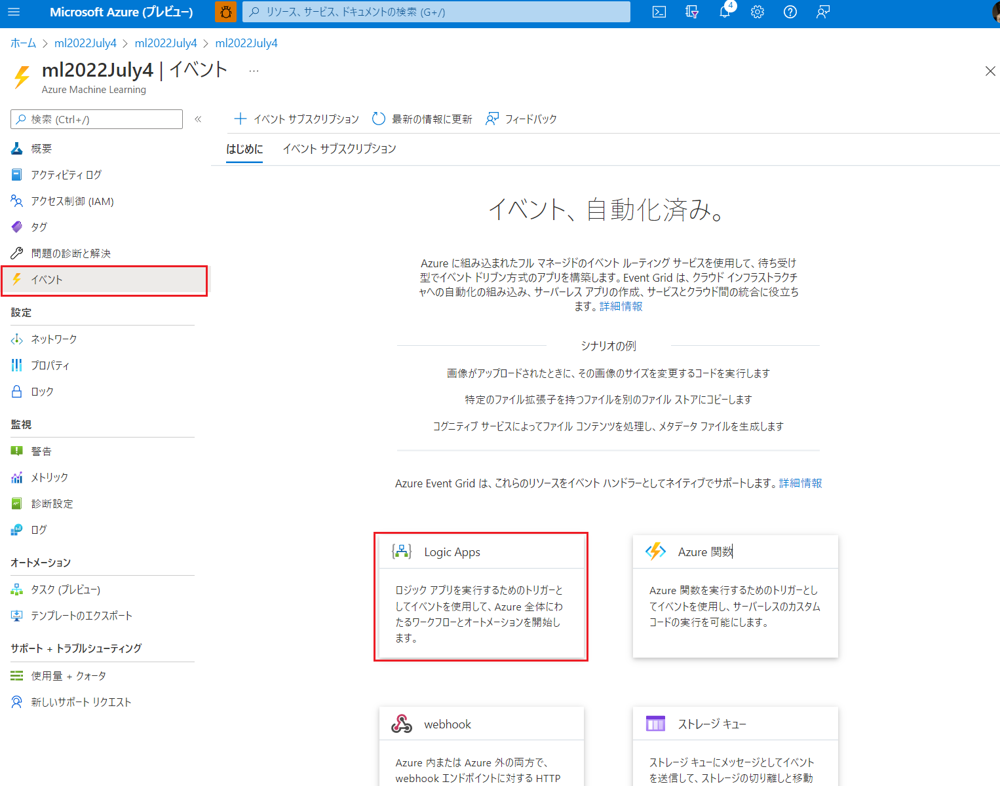

4\. ロジック アプリの UI にサインインし、「続行」をクリックします。

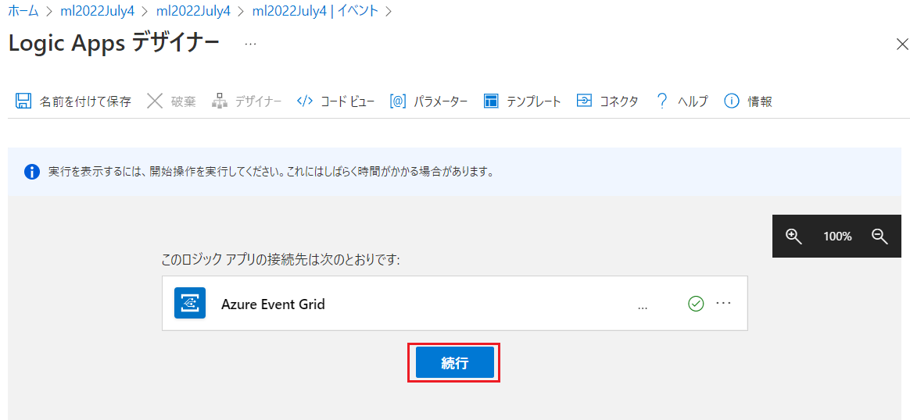

5\. リソースイベント発生トリガーでは、以下のように入力して「新しいステップ」をクリックします。
 - サブスクリプション: 今回使用しているサブスクリプション
 - リソースの種類: `Microsoft.MachineLearningServices.Workspaces`
 - リソース名: 今回使用している Azure Machine Learning リソース
 - イベントの種類: `Microsoft.MachineLearningServices.ModelRegistered`

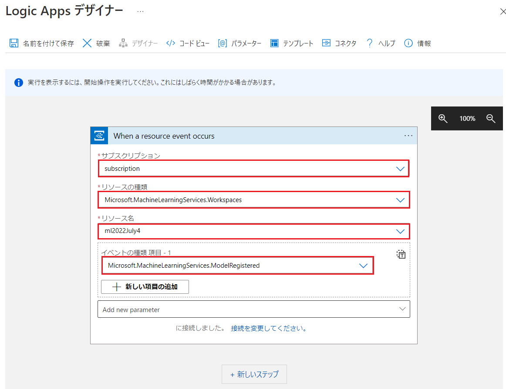

6\. 新しいステップが追加されたら、「ビルトイン」タブを選択し、検索ボックスに「json」と入力して「JSON の解析」アクションをクリックします。

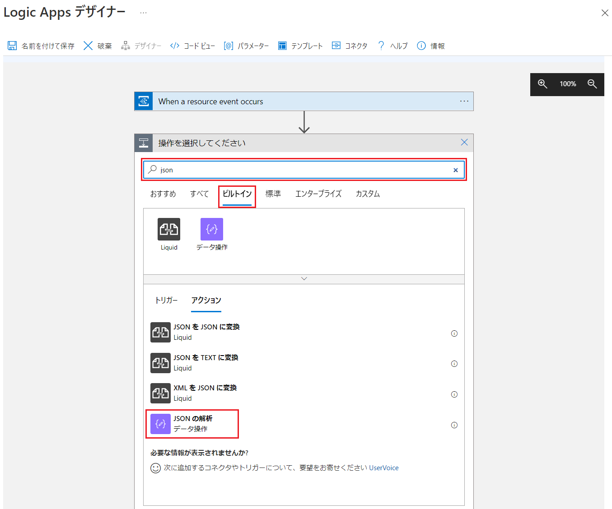

7\. 「JSON の解析」アクションでは「コンテンツ」ボックスをクリックし、右側のメニューから前のステップからの入力である「本文」を選択します。

スキーマには [06_schema.json](./06_schema.json) の中身をコピー&ペーストします。

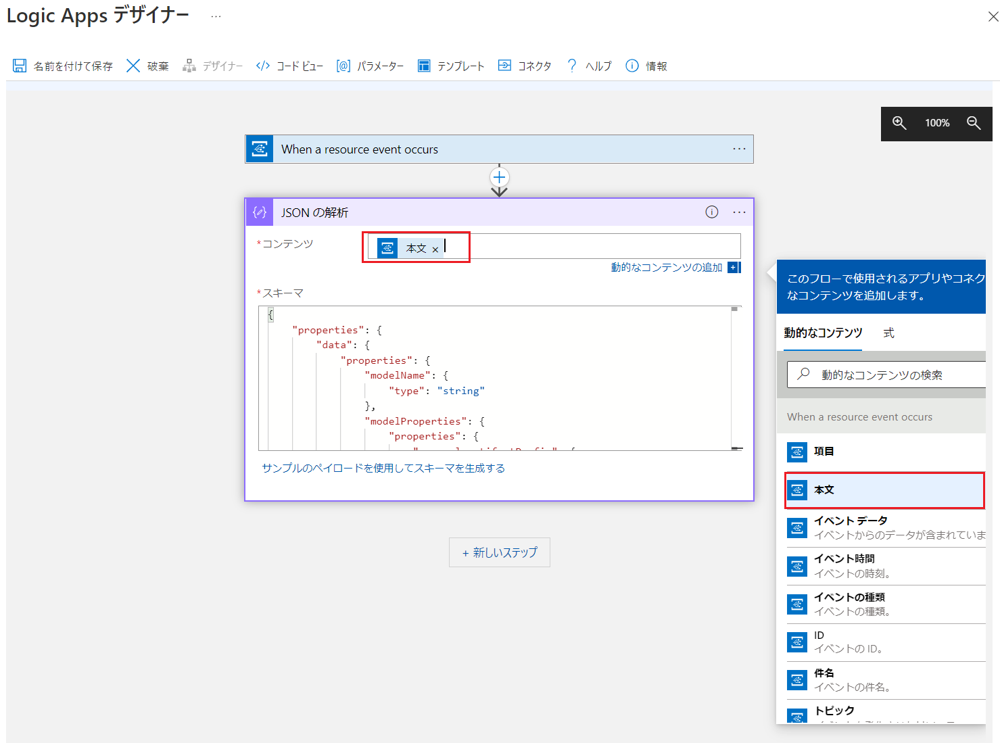

8\. 新しいステップをクリックし、「標準」タブを選択し、検索ボックスに「github」と入力して「リポジトリ ディスパッチ イベントを作成する」アクションをクリックします。

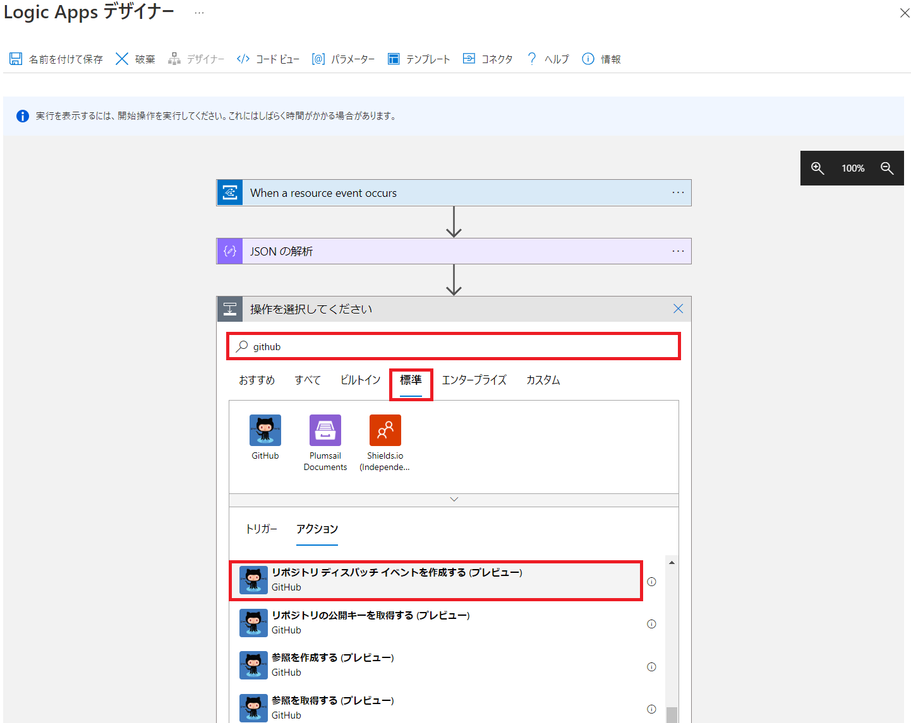


9\. Github への「サインイン」をクリックし、ご自分の Github アカウントで認証してください。

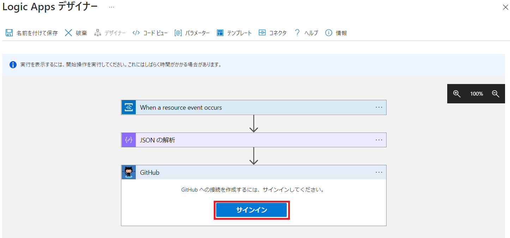


10\. 「リポジトリ ディスパッチ イベントを作成する」アクションでは、以下のとおりに入力します。
 - リポジトリ所有者: `<Github UserName>`　
 - リポジトリ名: `<Github RepositoryName>`

11\. 次に下部の「Add new parameter」ドロップダウンをクリックし、「イベント名」と「イベント ペイロード」チェックをオンにします。オンにしたら一旦キャンバス部分をクリックしてフォーカスを外します。

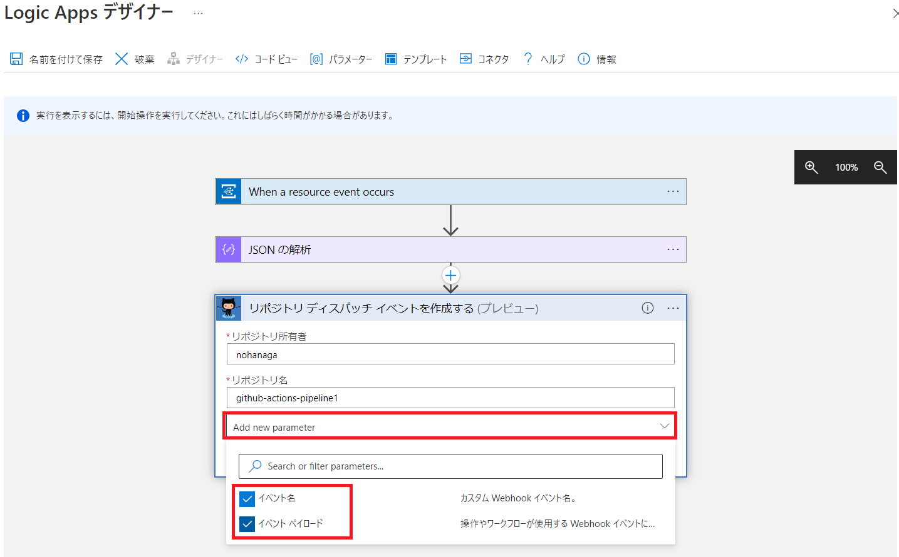

12\. すると追加の設定が表示されるので以下のように入力して、左上の「名前を付けて保存」ボタンをクリックします。

 - イベント名: `deploy_pipeline_action`
 - イベント ペイロード: 以下の未完成の JSON をコピー&ペーストし、`modelName` と `modelVersion` は画像のようにメニューから選択します。前のステップの「JSON の解析」アクションが JSON をパースしてくれているので、このように特定のキーを当てはめることができるようになります。

 ```json
{
  "model_name": ,
  "model_version": 
}
 ```

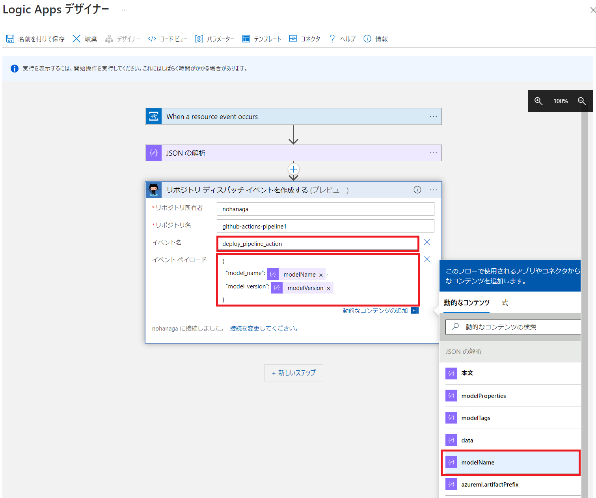

13\. ロジック アプリの作成画面で、「ロジック アプリ名」に任意の名前を設定して「作成」ボタンをクリックします。

クリック後、一旦デザイナー画面に戻りますが、バックグラウンドでリソース作成ジョブが実行されています。作成が完了し、リソースグループの中にロジック アプリが表示されるまで若干のラグがあります。

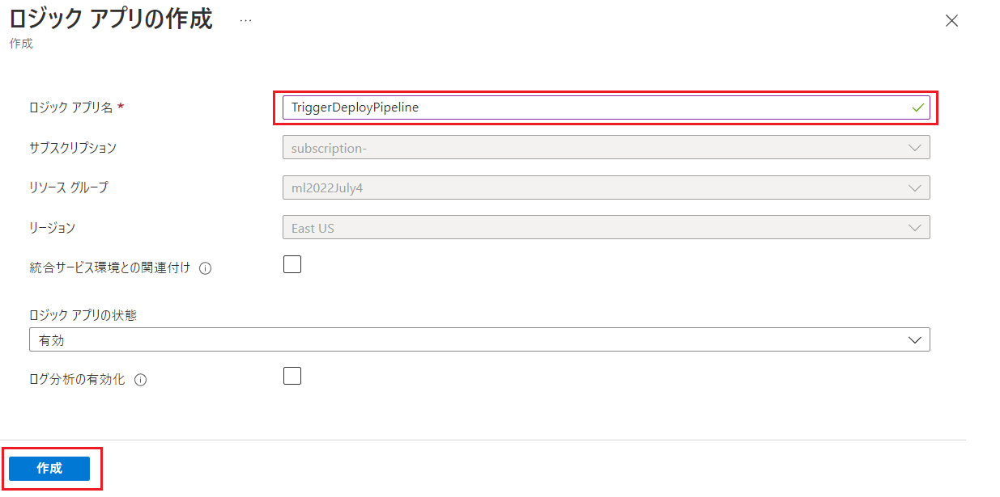


14\. [Challenge 2](../Challenge-02.md) などで作成したモデル登録コードを実行して、正常に動作するかを検証します。

15\. ロジック アプリの実行履歴は、概要ページから確認することができます。

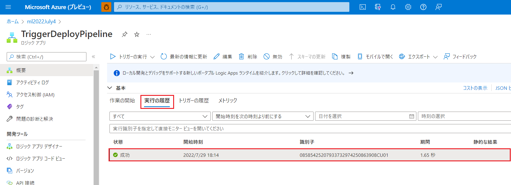

16\. 状態が「正常」であればデプロイパイプラインが起動され、パイプラインジョブが実行されます。実行履歴画面から、ステップごとに実際に流れたデータを確認することができます。以下の図では、AML から `ModelRegistered` イベントと共に送られてきたモデル名とモデルバージョン番号を正常に Github Actions へ送信できたことを示しています。

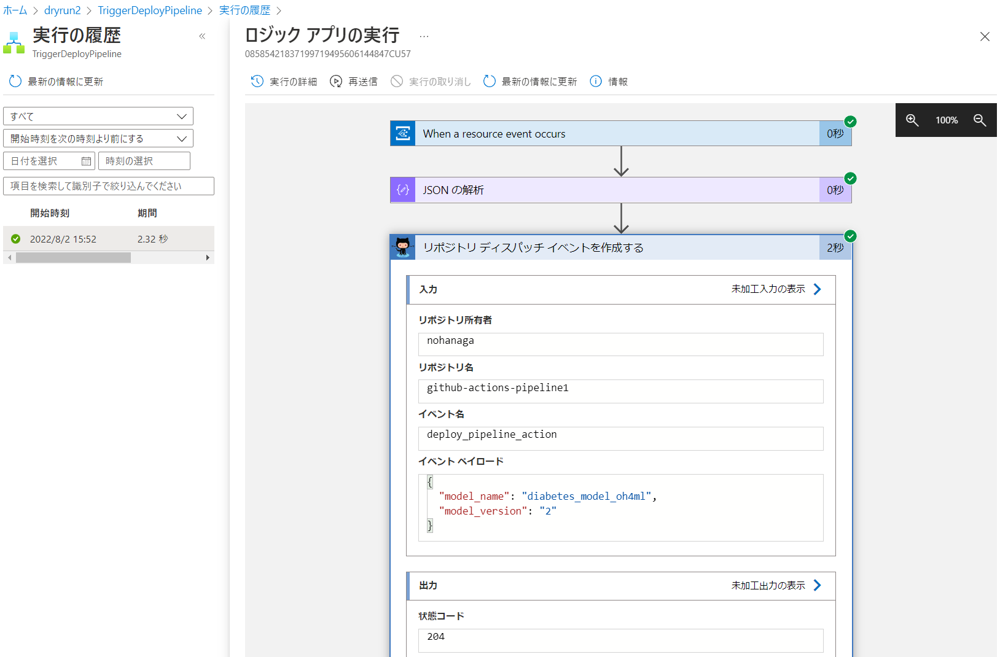

17\. Github Actions 側のデプロイパイプラインが正常に起動していることを確認します。

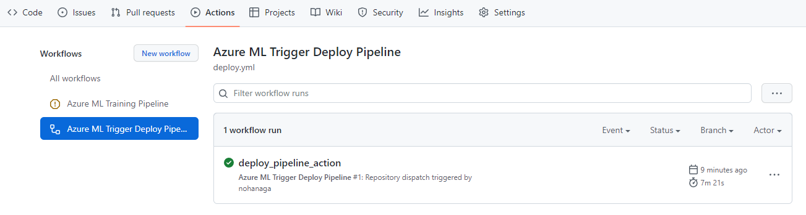

18\. Azure Machine Learning で新しいモデルがエンドポイントにデプロイされたことを確認できれば完了です。

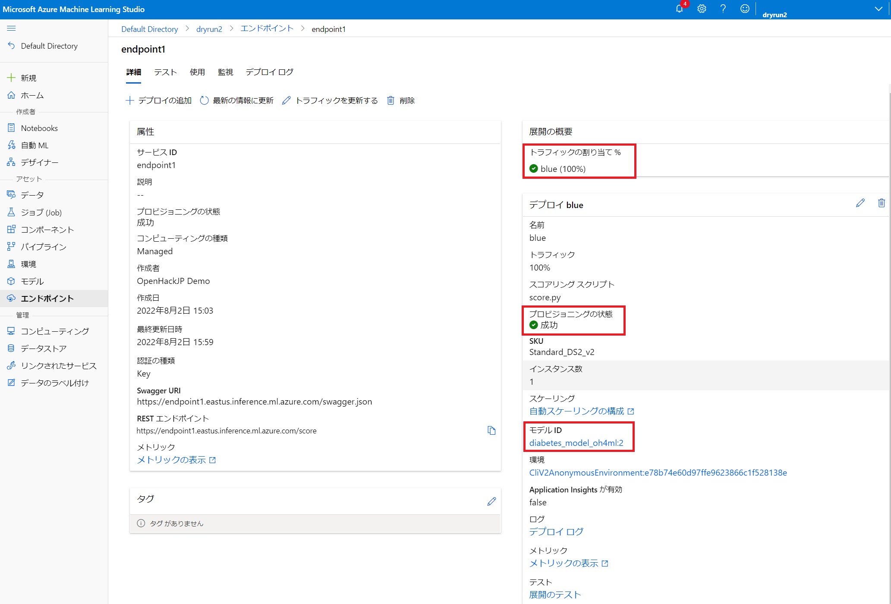


[< Back](../Challenge-06.md) 