# Challenge 6 – 3. Azure DevOps デプロイパイプライン構築手順解説
[< Back](../Challenge-06.md) - **[Home](../README.md)** 

本解説では、[Challenge 6](../Challenge-06.md) において Azure DevOps を用いてデプロイパイプラインを構築し、Azure Machine Learning のエンドポイントにモデルをデプロイするワークフローを作成します。

簡単な流れは以下のようになります。
1. Azure Pipelines にサインインし、Azure Resource Manager の接続を作成します。
1. Azure DevOps の Repos を使ってリポジトリを作成します。
1. Azure DevOps の Pipeline を使ってデプロイパイプラインを作成します。

> **重要: 無料アカウントもしくは Azure Pass で Azure DevOps を使用している場合、パイプライン実行時に[申請](https://learn.microsoft.com/azure/devops/release-notes/2021/sprint-184-update)が必要となり申請に 2~3 日かかります。すでにパイプラインが実行可能な方のみ選択してください。**

## 手順1. Azure Pipelines にサインイン

1. [Azure Pipelines](https://azure.microsoft.com/services/devops/pipelines) を開き、「無料で始める」を選択します。

1. Microsoft アカウントにログインします。

1. Azure Pipelines の使用を開始するには、ご自分でユニークな組織名を設定後、画像認証を入力して「Continue」を選択します。

    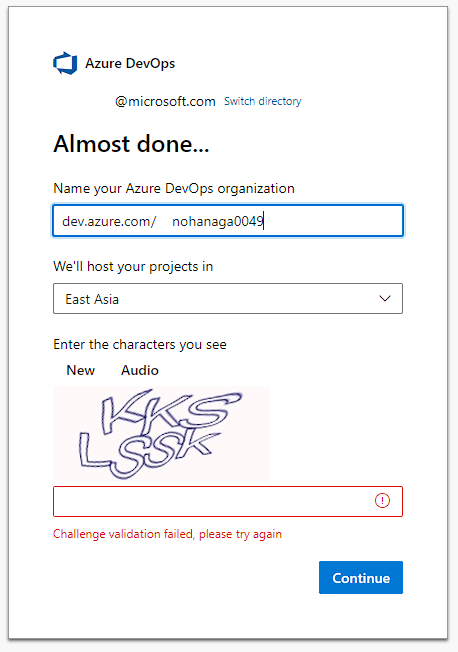

    次の URL を使用して、いつでも組織にサインインできます。 `https://dev.azure.com/{yourorganization}`

1. 選択した組織内で、"プロジェクト" を作成します。組織にプロジェクトがない場合、「プロジェクトを作成して開始します」画面が表示されます。任意のプロジェクト名を入力し、今回は `Private` プロジェクトを選択して 「Create project」ボタンをクリックします。

    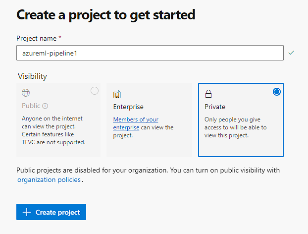

1. Azure Pipelines のホームが表示されます。左下の「Project settings」をクリックします。

    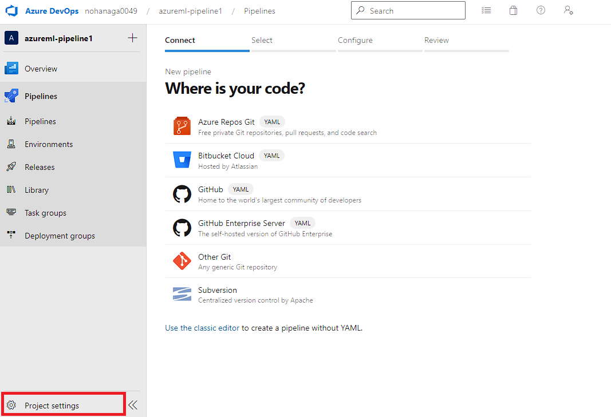

1. Project Settings 画面のメニューから「Service connections」を選択し、「Create service connection」ボタンをクリックします。

    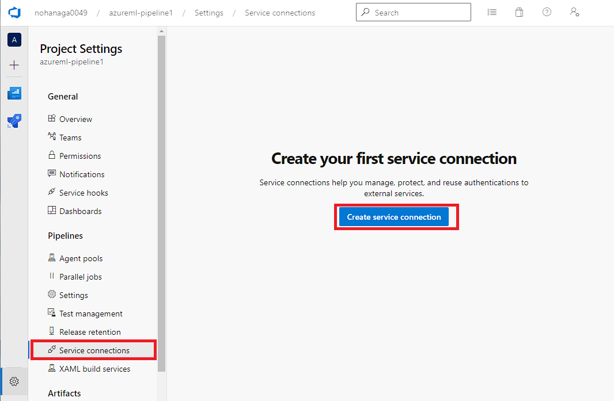

1. 「New service connection」ペインで、「Azure Resource Manager」を選択し「Next」ボタンをクリックします。
1. 「Authentication method」で「Service principal (automatic)」を選択します。
1. 最後にサービス接続を作成します。サブスクリプション、リソース グループを選択し、「Service connection name」には任意の接続名を設定して「Save」をクリックします。

    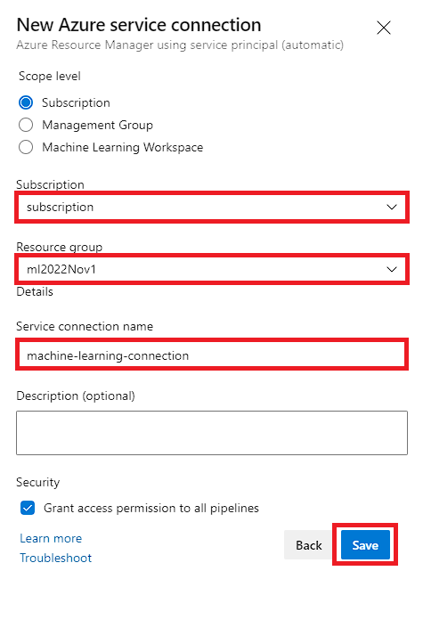

    > **注意**
    > リソースグループには今回のワークショップのために作成した Azure ML リソースが含まれているリソースグループ名を選択してください。

1. Service connections に以下のように追加されていれば成功です。

    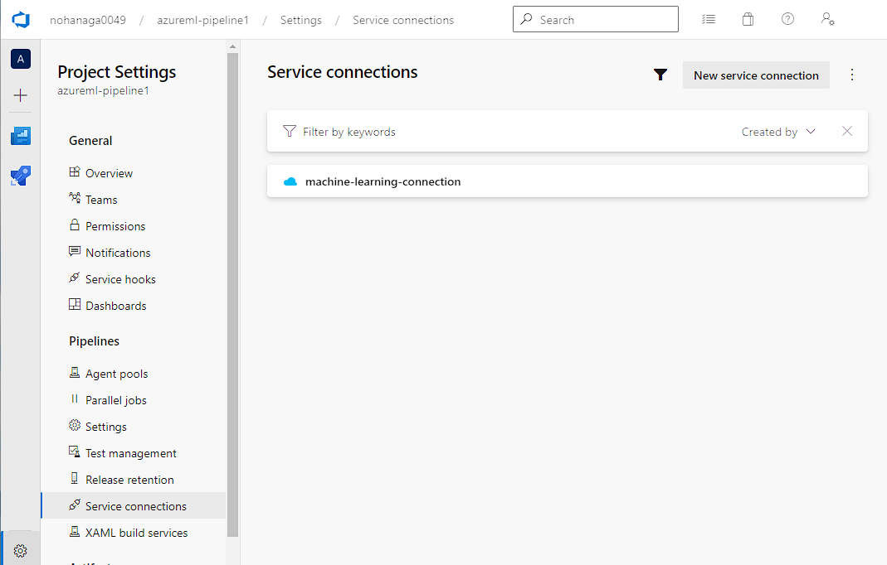

    これにより対象のリソースグループのアクセス制御の共同作成者にサービスプリンシパルが追加され、Azure DevOps から Azure Machine Learning を操作できるようになりました。

## 手順2. リポジトリの作成
ソースコードやパイプラインワークフローを保存するためのリポジトリを作成します。デフォルトではリポジトリ サービスが有効化されておりませんので、有効化します。

1. 再び「Project settings」を開き、「Overview」メニューを選択し、Azure DevOps services リストから「Repos」項目をオンに変更します。

    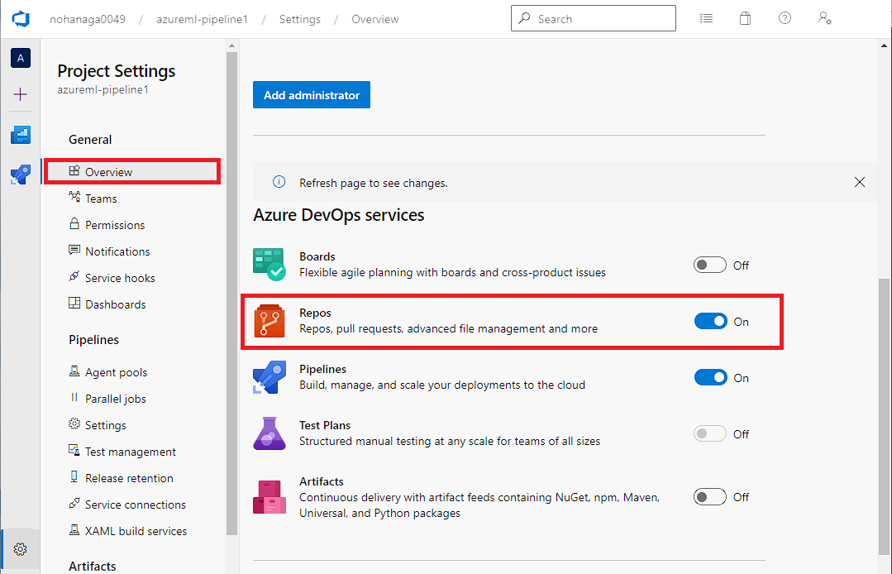

1. ブラウザ画面を更新すると、左メニューにレポジトリアイコンが追加されます。

    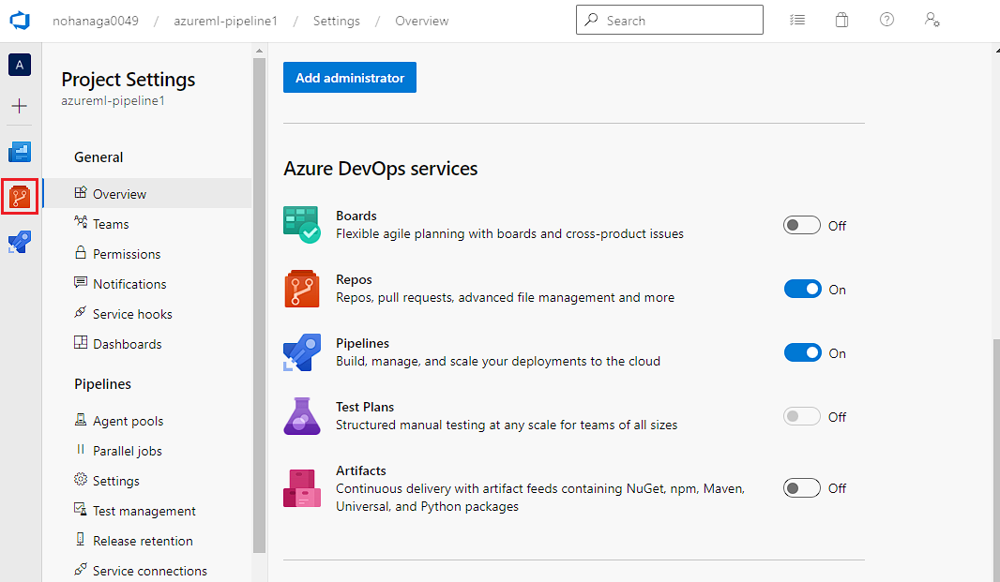

1. Repos アイコンをクリックし、「Files」メニューを選択して、画面下部の「Initialize」ボタンをクリックします。

    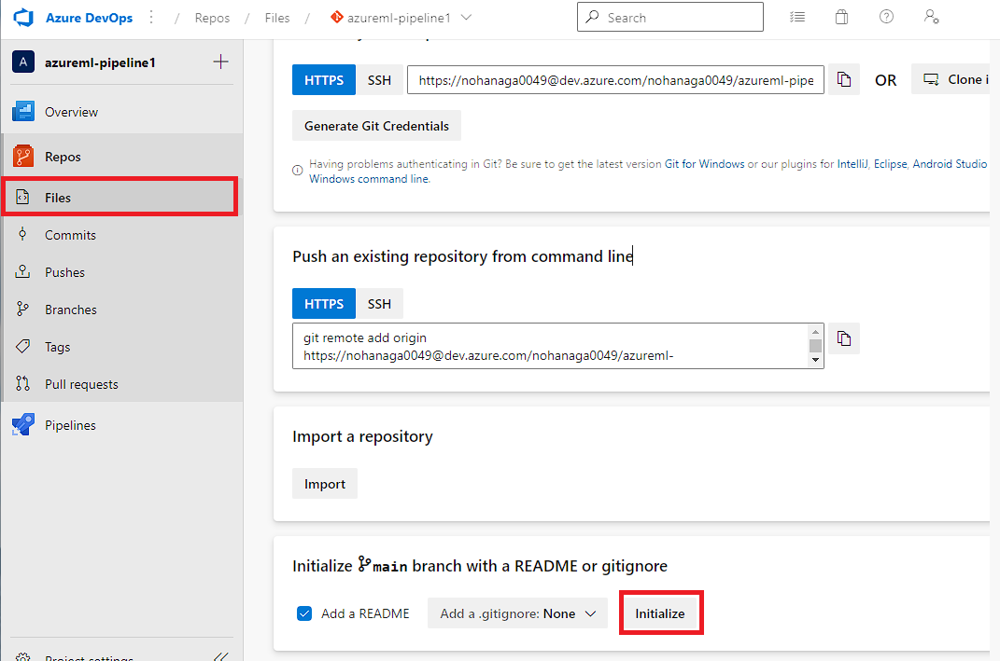

1. リポジトリの初期化が完了すると、README.md が整備された初期リポジトリが作成されます。

    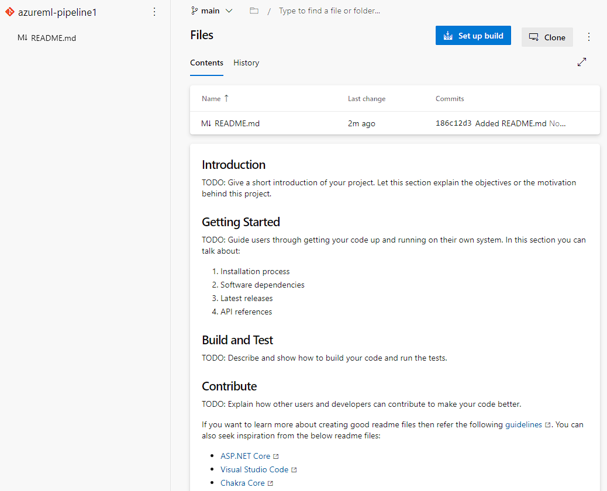

1. リポジトリにデプロイパイプライン実行に必要なファイルをアップロードします。今回は [Chellenge 3](../Challenge-03.md) で作成した 3 つのファイルをそのまま使用します。

    ```
    /
    ├── environments
    │   └── 03_conda_env.yml
    ├── scripts
    │   └── score.py
    └── 03_managed_deployment.yml
    ```

1. まずは以下のように選択し、フォルダを作成します。

    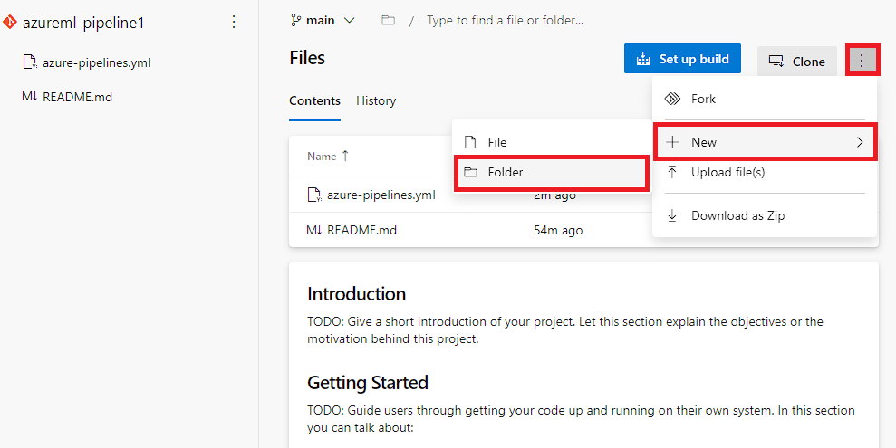

1. 新規フォルダ作成画面では、フォルダ名とその下に作成するファイルを同時に指定できます。

    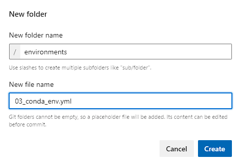

1. ファイルの中身は、[Chellenge 3](../Challenge-03.md) で作成したファイルをそのままコピー&ペーストして「Commit」ボタンをクリックします。

    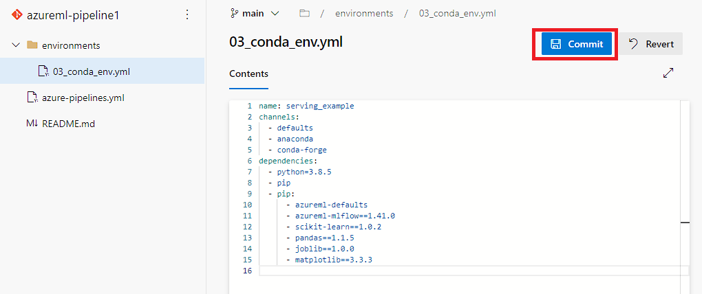

    > **注意**
    > ファイルをフォルダにアップロードする機能「Upload files(s)」を使うこともできます。

1. 同様に `/scripts/score.py` と `/03_managed_deployment.yml` を作成し、コミットすれば準備完了です。


## 手順3. デプロイパイプラインの作成
1. Azure Pipelines アイコンをクリックし、「Pipelines」メニューを選択して「Create Pipeline」ボタンをクリックします。

    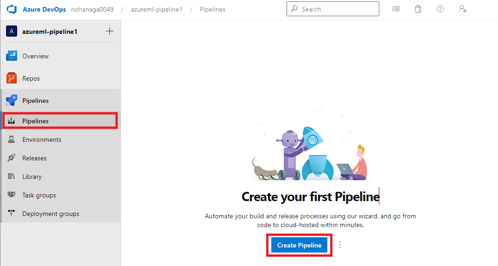

1. 「Where is your code?」では「Azure Repos Git」を選択します。

    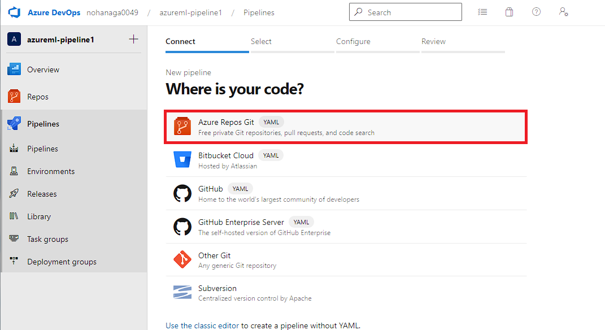

1. 「Select a repository」では作成済みの「azureml-pipeline1」を選択します。

    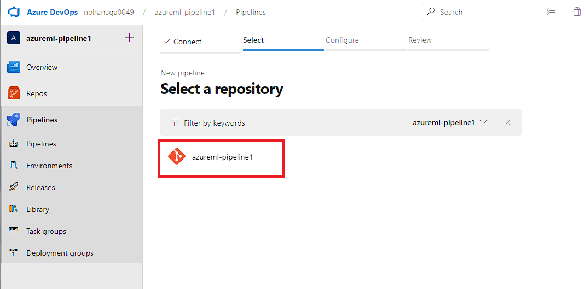

1. 「Configure your pipeline」では「Starter pipeline」を選択します。

    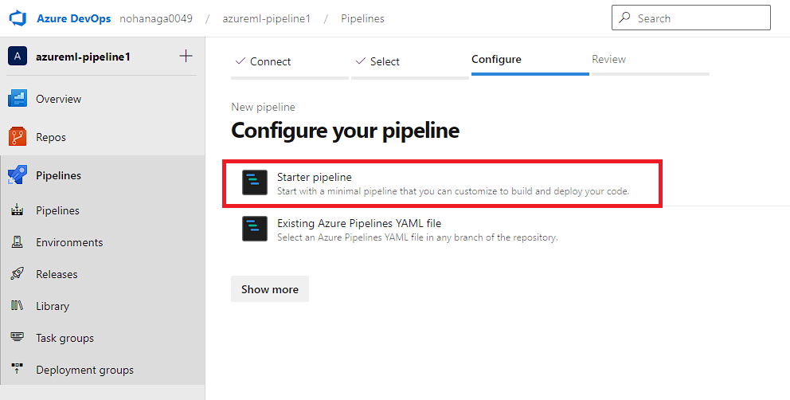

1. スターターパイプラインのサンプルとして Hello, world! が表示されますので、以下ですべてを置き換えます。

    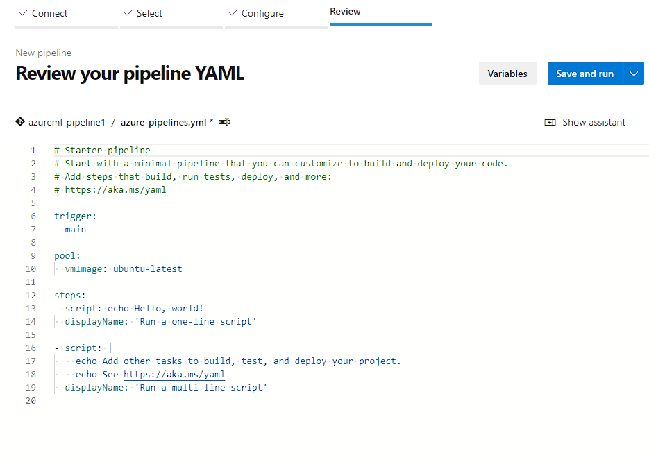


    ```yml
    trigger: none  
    pr: none 

    parameters:  
      - name: "model_name"  
        type: string  
        displayName: "ModelName"  
      - name: "model_version"  
        type: number  
        default: 0  
        displayName: "ModelVersion"  

    pool:
      vmImage: ubuntu-latest

    steps:
    - task: AzureCLI@2
      displayName: Azure CLI
      inputs:
        azureSubscription: machine-learning-connection
        scriptType: bash
        scriptLocation: inlineScript
        inlineScript: |
          az version
          az extension add --name ml --version 2.10.0
          az version
          yq -i '.model = "azureml:${{parameters.model_name}}:${{parameters.model_version}}"' 03_managed_deployment.yml
          az ml online-deployment update -f 03_managed_deployment.yml -g $(RESOURCE_GROUP) -w $(AML_WORKSPACE_NAME)
    ```

1. 置き換えた YAML の中の `azureSubscription` はご自分が任意で入力した内容と一致しているか確認してください。

    > **注意**
    > `azureSubscription` 項目は、手順 1.10 で作成した「Service connection name」と一致している必要があります。


## 手順4. 変数の定義
Azure には Azure Machine Learning で使用するリソース グループが既にあるはずです。 DevOps パイプラインを AzureML にデプロイするには、サブスクリプション ID、リソース グループ、機械学習ワークスペースの変数を作成する必要があります。

1. 「Variables」ボタンをクリックして、次に「New variable」ボタンをクリックします。

    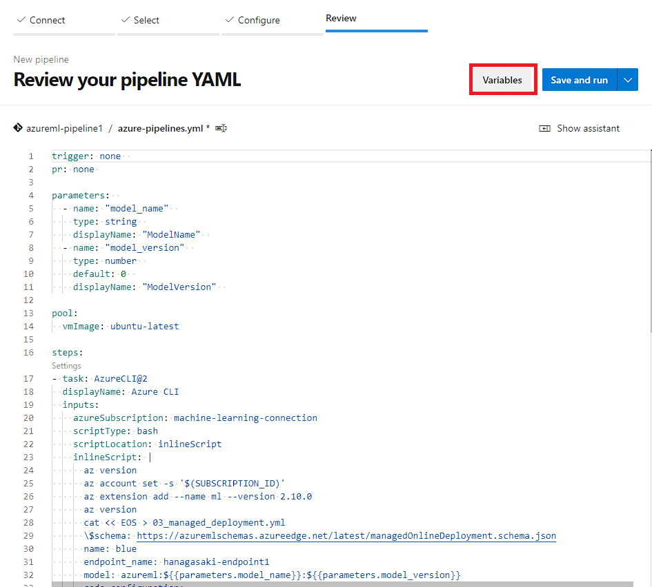

1. 以下の変数を登録します。

    - Name: `RESOURCE_GROUP`
    - Value: リソースグループ名
    - Name: `AML_WORKSPACE_NAME`
    - Value: Azure Machine Learning ワークスペース名

1. 「Save」ボタンをクリックして変数を保存します。

    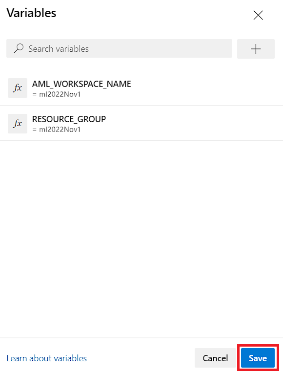

1. この時点ではパイプラインを起動しませんので右上の「˅」ボタンを選択し、「Save」メニューをクリックします。保存時のコミットメッセージはそのままで「Save」ボタンをクリックします。

    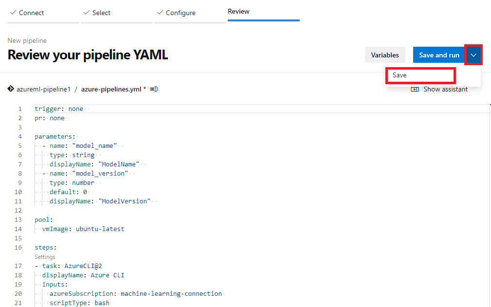

    このワークフローは `trigger: none`, `pr: none` を定義することによってコードコミットやプルリクエストでトリガーするのを抑制しています。今回は Azure Machine Learning で発生したモデル登録イベントを Logic Apps 経由で Azure Pipelines の REST API に POST されたリクエストのみでトリガーされるようにするためです。

1. これでデプロイパイプラインの構築は完了です。

## 手順5. OAuth によるサードパーティアプリケーションのアクセス許可
Azure Pipelines で構築したパイプラインは、外部サービスから REST API エンドポイントを通じてトリガーすることができます。エンドポイントにリクエスト送信する際にはユーザー名とパスワードではなく、OAuth による認証を使用します。

1. 画面左上の組織名をクリックし、組織のホームを表示します。ブラウザの URL に `https://dev.azure.com/{Organizaion}/` と入力してもアクセスできます。

    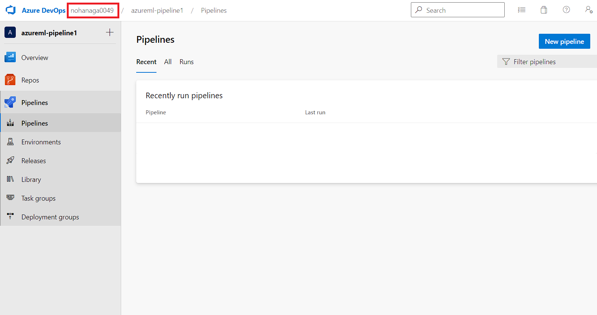

1. 組織のホームで、「Organization settings」メニューをクリックします。

    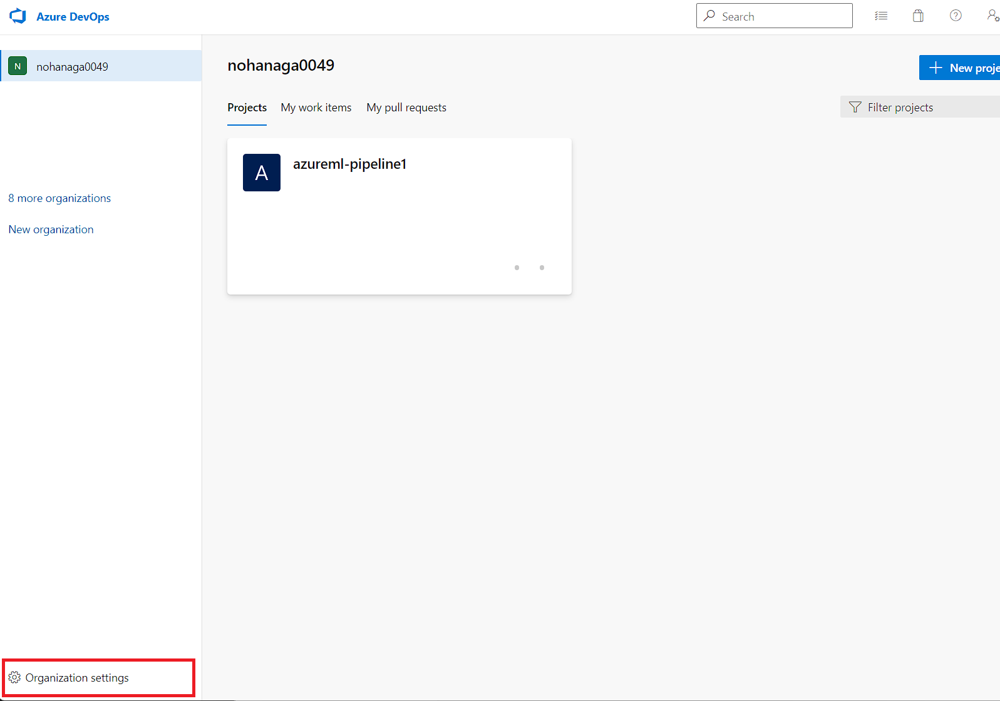

1. 「Organization settings」から Security の「Policies」を選択し、「Third-party application access via OAuth」を ON に設定します。

    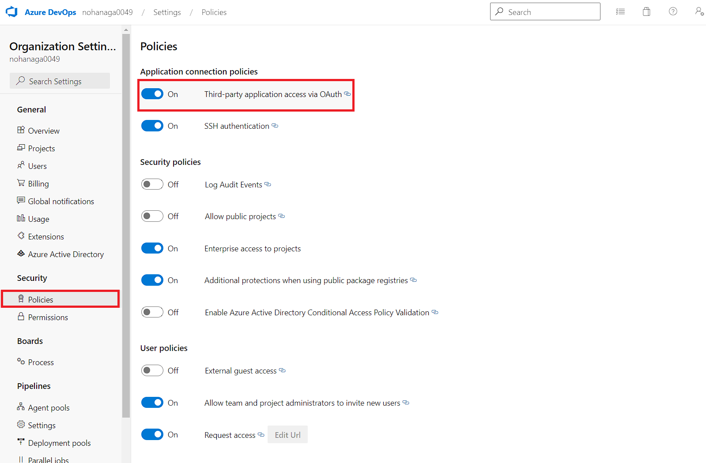

1. これですべての準備が完了です。


[< Back](../Challenge-06.md)