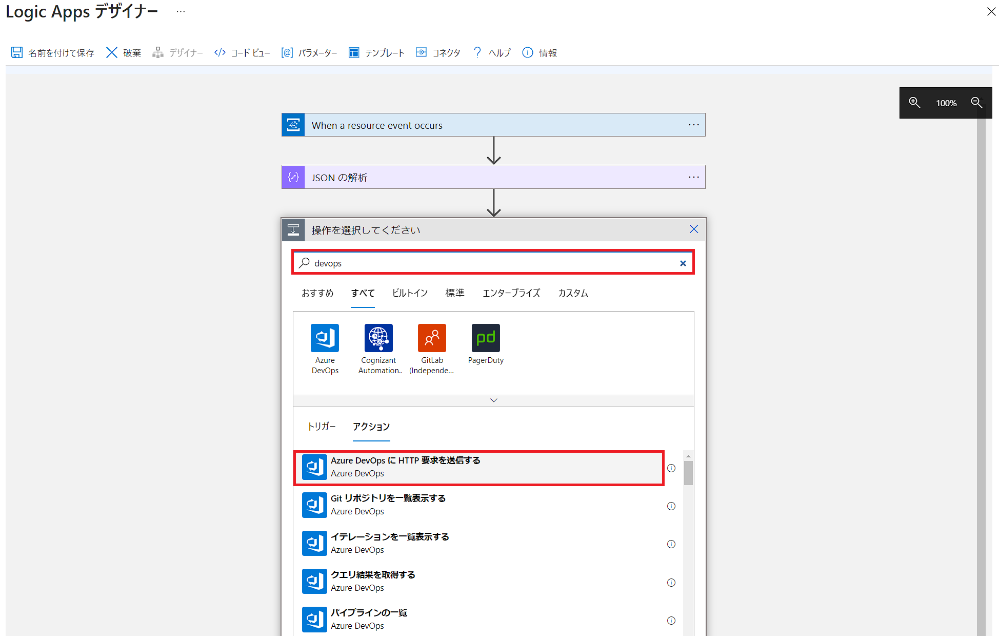
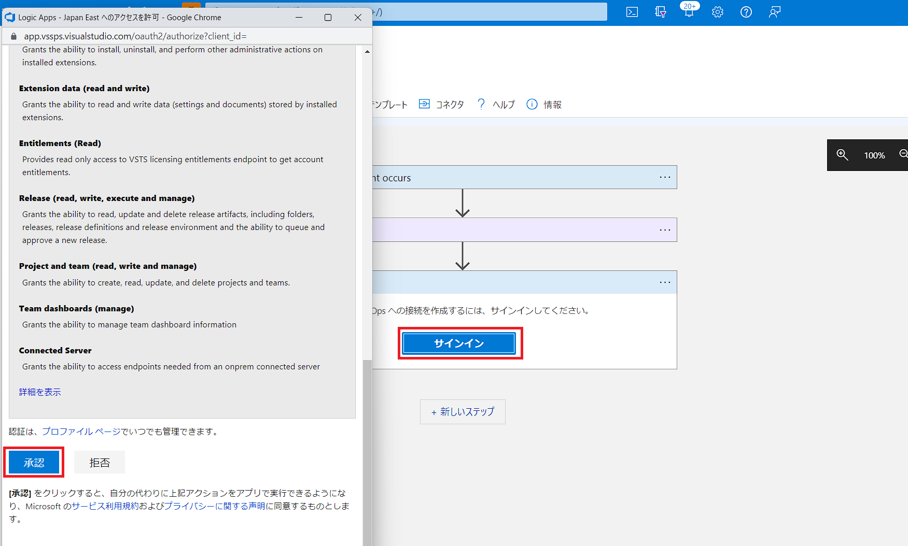
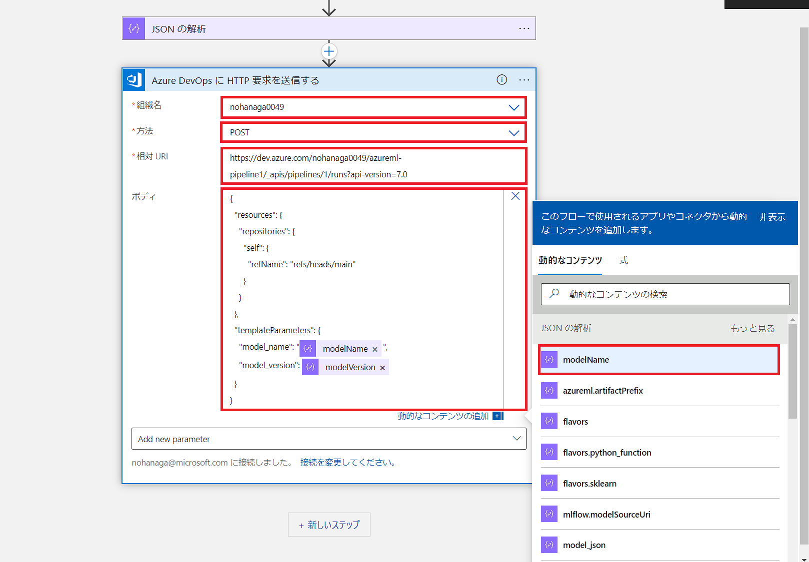
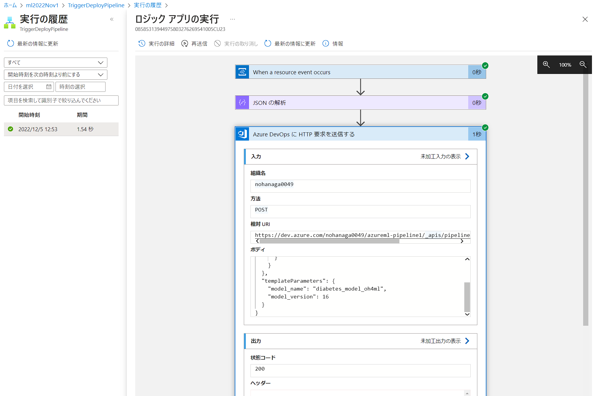
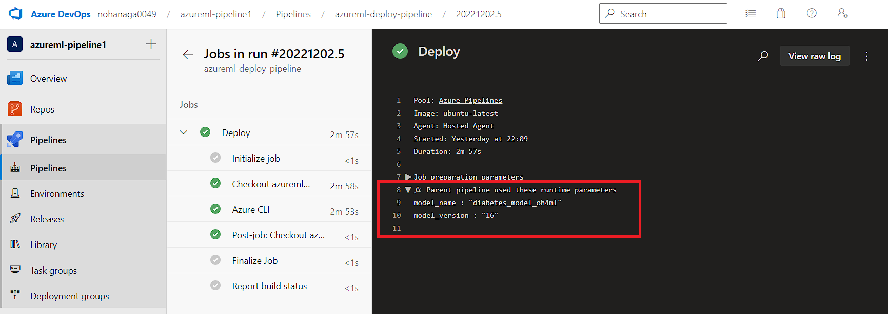

# Challenge 6 – 4. Logic Apps によるモデル登録トリガー 手順解説(Azure DevOps編)
[< Back](../Challenge-06.md) - **[Home](../README.md)** 

本解説では、[Challenge 6](../Challenge-06.md) で作成したデプロイパイプラインを Azure Machine Learning のモデル登録イベントをトリガーにして起動する手順を解説します。

簡単な流れは以下のようになります。
1. Azure Machine Learning からのモデル登録イベントを受信しトリガーとする
1. モデル登録イベントデータ(JSON)をパースし、モデル名とモデルバージョン番号を取れるようにする
1. モデル名とモデルバージョン番号をパラメータにセットして、Azure Pipelines 上のデプロイパイプラインを実行する REST エンドポイントをコールする

## 手順

1. Azure サブスクリプションで LogicApps/Event Grid を使用したことがない場合は、リソース プロバイダーを登録する必要があります。

    [Azure Portal](https://ms.portal.azure.com/) で次の操作を行います。

    1. ホームから鍵のアイコンの「サブスクリプション」を選択します。
    1. 演習で使用するサブスクリプションを選択します。
    1. 左側のメニューの「設定」で、「リソース プロバイダー」を選択します。
    1. `Microsoft.EventGrid` を検索します。
    1. 登録されていない場合は、「登録」を選択します。
    1. 登録完了まで少し時間がかかることがあります。「最新の情報に更新」を選択して、状態を更新します。「状態」が「登録済み」になったら、次に進めることができます。
    1. 同様に `Microsoft.Web` も登録します。

1. [Azure Portal](https://ms.portal.azure.com/) で Azure Machine Learning ワークスペースに移動します。

1. 左側のバーの「イベント」タブを選択します。 ここで、「Logic Apps」を選択します。

    

1. ロジック アプリの UI にサインインし、「続行」をクリックします。

    

1. リソースイベント発生トリガーでは、以下のように入力して「新しいステップ」をクリックします。
    - サブスクリプション: 今回使用しているサブスクリプション
    - リソースの種類: `Microsoft.MachineLearningServices.Workspaces`
    - リソース名: 今回使用している Azure Machine Learning リソース
    - イベントの種類: `Microsoft.MachineLearningServices.ModelRegistered`

    <br>
    

1. 新しいステップが追加されたら、「ビルトイン」タブを選択し、検索ボックスに「json」と入力して「JSON の解析」アクションをクリックします。

    

1. 「JSON の解析」アクションでは「コンテンツ」ボックスをクリックし、右側のメニューから前のステップからの入力である「本文」を選択します。

    スキーマには [06_schema.json](./06_schema.json) の中身をコピー&ペーストします。これでイベント発生時に送信されてくるモデル名とモデルバージョンを後のステップでアクセスできるようになります。

    

1. 新しいステップをクリックし、検索ボックスに「devops」と入力して「Azure DevOps に HTTP 要求を送信する」アクションをクリックします。

    

1. 初めて Azure DevOps にサインインする場合は「サインイン」ボタンをクリックして OAuth 認証のポップアップウィンドウで「承認」ボタンをクリックします。これで Azure Logic Apps から Azure DevOps へ OAuth 経由で接続できるようになります。

    

1. 「Azure DevOps に HTTP 要求を送信する」アクションでは、以下のとおりに入力します。さらに下部の「Add new parameter」ドロップダウンをクリックし、「ボディ」チェックをオンにします。オンにしたら一旦キャンバス部分をクリックしてフォーカスを外します。
    - 組織名: ご自分の組織名をドロップダウンから選択
    - 方法: `POST`
    - 相対 URI: `https://dev.azure.com/{Organization}/{ProjectName}/_apis/pipelines/{PipelineID}/runs?api-version=7.0`

      > **注意**
      > Azure Pipelines のパイプライン管理画面から作成したパイプラインをクリックしたときの URL からマッピングします。`https://dev.azure.com/{Organization}/{ProjectName}/_build?definitionId={PipelineID}&view=runs` のような対応になります。PipelineID は整数値であることに注意してください。

    - 本文: 以下の未完成の JSON をコピー&ペーストし、`modelName` と `modelVersion` は画像のように動的メニューから選択します。`"model_name"` はダブルクォーテーションの間にカーソルを合わせて挿入します。

        ```json
        {
          "resources": {
            "repositories": {
              "self": {
                "refName": "refs/heads/main"
              }
            }
          },
          "templateParameters": {
            "model_name": "",
            "model_version": 
          }
        }
        ```

        

        前のステップの「JSON の解析」アクションが JSON をパースしてくれているので、このように特定のキーを当てはめることができるようになります。

1. ロジック アプリの作成画面で、「ロジック アプリ名」に任意の名前を設定して「作成」ボタンをクリックします。

    クリック後、一旦デザイナー画面に戻りますが、バックグラウンドでリソース作成ジョブが実行されています。作成が完了し、リソースグループの中にロジック アプリが表示されるまで若干のラグがあります。

    


1. [Challenge 2](../Challenge-02.md) などで作成したモデル登録コードを実行して、正常に動作するかを検証します。

1. ロジック アプリの実行履歴は、概要ページから確認することができます。

    

1. 状態が「正常」であればデプロイパイプラインが起動され、パイプラインジョブが実行されます。実行履歴画面から、ステップごとに実際に流れたデータを確認することができます。以下の図では、AML から `ModelRegistered` イベントと共に送られてきたモデル名とモデルバージョン番号を正常に Azure DevOps へ送信できたことを示しています。

    

1. Azure Pipelines 側のデプロイパイプラインが正常に起動していることを確認します。下のようにパイプラインに送信されたパラメーターが受信できていることも確認できます。

    

1. Azure Machine Learning で新しいモデルがエンドポイントにデプロイされたことを確認できれば完了です。

    


[< Back](../Challenge-06.md) 