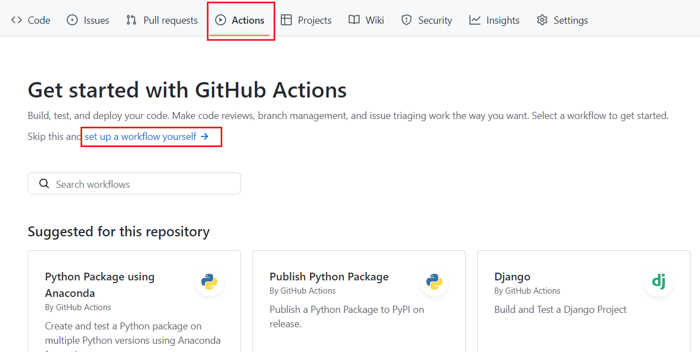
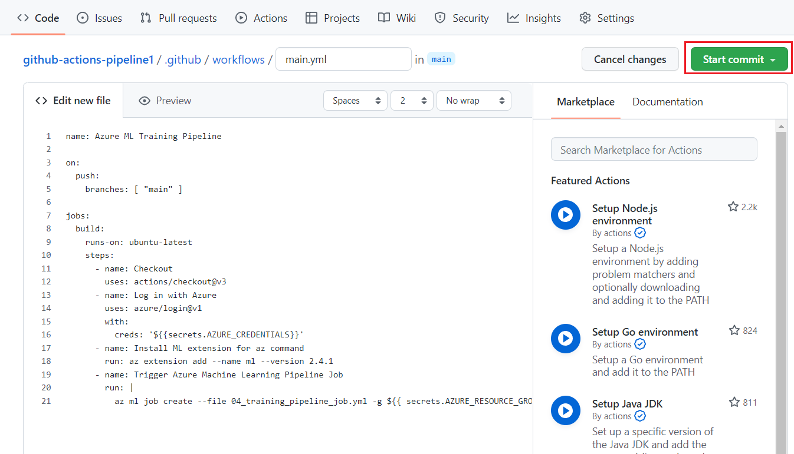
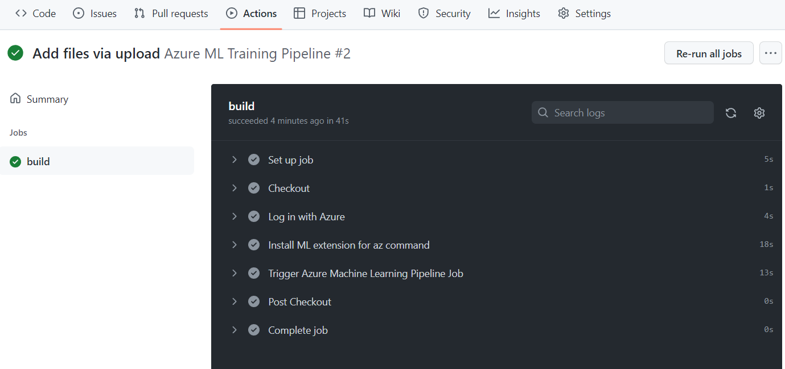
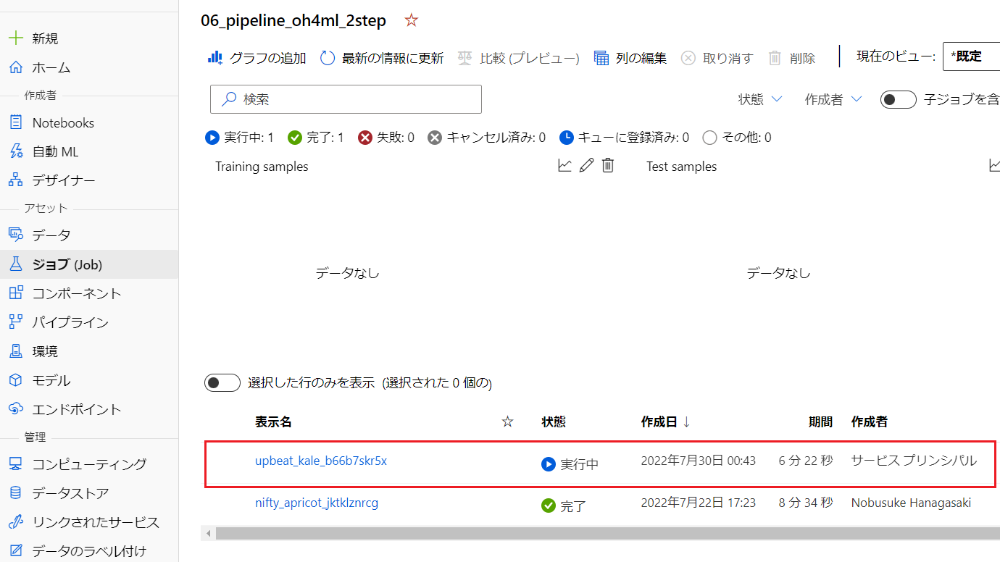

# Challenge 8 – Github Actions 全手順解説
[< Back](../Challenge-08.md) - **[Home](../README.md)** 

本解説では、[Challenge 8](../Challenge-08.md) の Github Actions を用いて Azure Machine Learning 上のトレーニングパイプラインをコードコミット駆動させる方法を解説します。

## 手順

1\. トレーニングパイプライン用に Github リポジトリを用意します。

2\. リポジトリにトレーニングパイプライン実行に必要なファイルをアップロードします。今回は [Chellenge 4](../Challenge-04.md) で作成した 3 つのファイルをそのまま使用します。

```
.
├── scripts
│   ├── train.py
│   └── register.py
└── 04_training_pipeline_job.yml
```

3\. リポジトリの 「Actions」 タブに移動し、「set up a workflow yourself」リンクをクリックします。



4\. Github Actions の 新しいワークフローを `.github/workflows` に作成します。「Edit new file」のテキストボックスに以下の yaml をコピー&ペーストして「Start commit」ボタンをクリックしてコミットします。




```yml
name: Azure ML Training Pipeline

on:
  push:
    branches: [ "main" ]

jobs:
  build:
    runs-on: ubuntu-latest
    steps:
      - name: Checkout
        uses: actions/checkout@v3
      - name: Log in with Azure
        uses: azure/login@v1
        with:
          creds: '${{secrets.AZURE_CREDENTIALS}}'
      - name: Install ML extension for az command
        run: az extension add --name ml --version 2.10.0
      - name: Trigger Azure Machine Learning Pipeline Job
        run: |
          az ml job create --file 04_training_pipeline_job.yml -g ${{ secrets.AZURE_RESOURCE_GROUP_NAME }} -w ${{ secrets.AZURE_ML_WORKSPACE_NAME }}
```

上記ワークフローは、`on: push` によってワークフローのリポジトリの main ブランチにプッシュが行われたときに起動するように設定されています。他のトリガー条件は「[ワークフローをトリガーするイベント](https://docs.github.com/actions/using-workflows/events-that-trigger-workflows)」を参照してください。

5\. 「Actions」タブでコミットしたワークフローの実行が確認できます。最初のワークフローコミット直後に 1 度ワークフローが実行されます。


6\. ワークフローの詳細から各ステップの実行結果を確認できます。



7\. Azure Machine Learning のジョブがサービスプリンシパルによって起動していることを確認します。ジョブが完了するとモデルが登録されます。



8\. [Challenge 6](../Challenge-06.md) で構築したデプロイパイプラインがモデルの登録トリガーによって起動していることを確認します。

9\. デプロイパイプラインの完了後に再度 `train.py` などのコードをコミットしてワークフローが起動することを確認します。

[< Back](../Challenge-08.md)