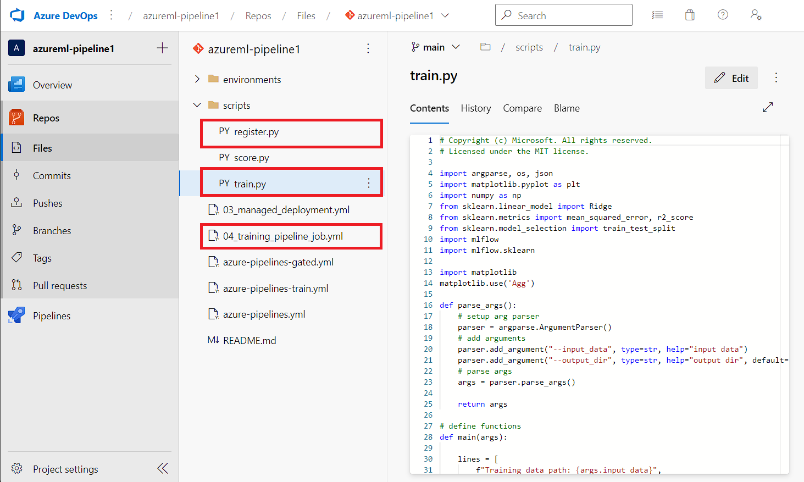
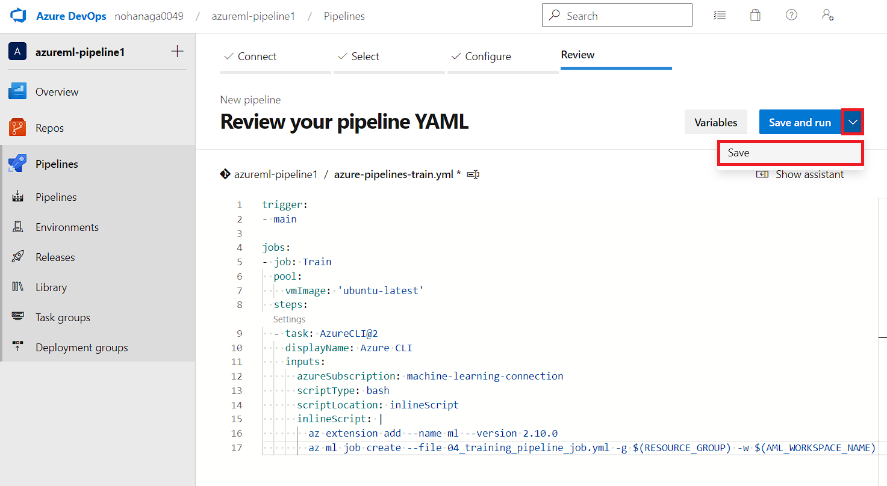
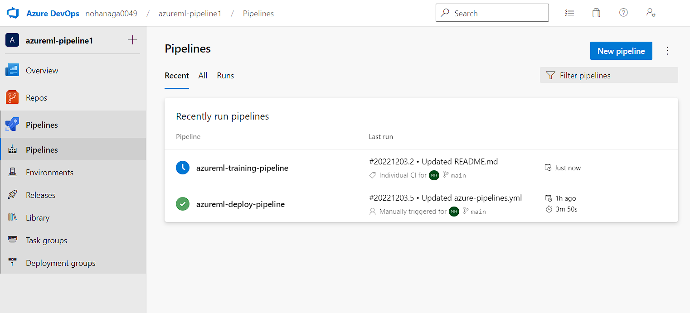
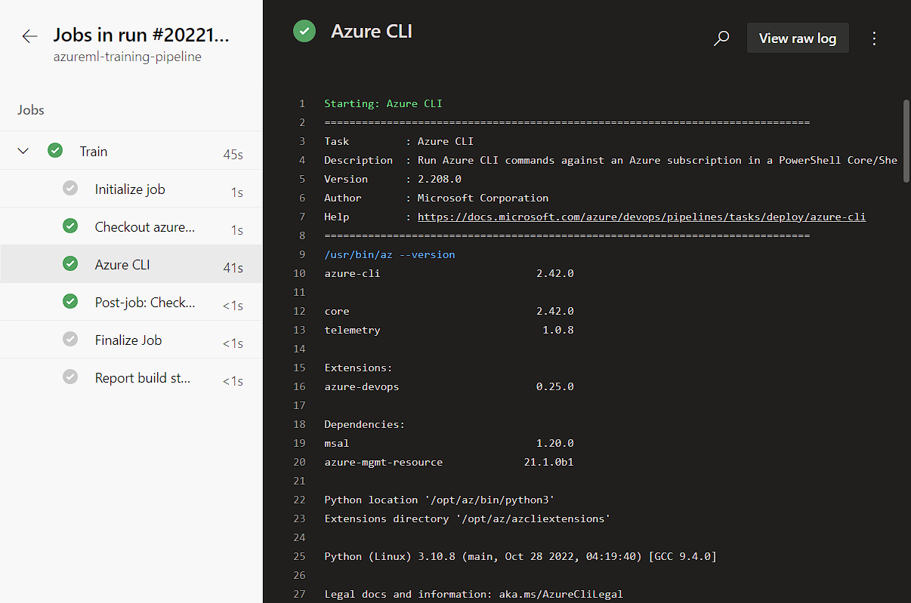

# Challenge 8 – 2. Azure DevOps 全手順解説
[< Back](../Challenge-08.md) - **[Home](../README.md)** 

本解説では、[Challenge 8](../Challenge-08.md) の Azure DevOps を用いて Azure Machine Learning 上のトレーニングパイプラインをコードコミット駆動させる方法を解説します。

## 手順

1. トレーニングパイプライン用に Azure Repos リポジトリを用意します。

1. リポジトリにトレーニングパイプライン実行に必要なファイルをアップロードします。今回は [Chellenge 4](../Challenge-04.md) で作成した 3 つのファイルをそのまま使用します。

    ```
    .
    ├── scripts
    │   ├── train.py
    │   └── register.py
    └── 04_training_pipeline_job.yml
    ```

    

1. Azure Pipelines で新しいパイプラインを作成します。「New pipeline」のテキストボックスに以下の YAML をコピー&ペーストして「Save」をクリックしてコミットします。

    


    ```yml
    trigger:
    - main

    jobs:
    - job: Train
      pool:
        vmImage: 'ubuntu-latest'
      steps:
      - task: AzureCLI@2
        displayName: Azure CLI
        inputs:
          azureSubscription: machine-learning-connection
          scriptType: bash
          scriptLocation: inlineScript
          inlineScript: |
            az extension add --name ml --version 2.10.0
            az ml job create --file 04_training_pipeline_job.yml -g $(RESOURCE_GROUP) -w $(AML_WORKSPACE_NAME)
    ```

    上記ワークフローは、`trigger: main` によってワークフローのリポジトリの main ブランチにプッシュが行われたときに起動するように設定されています。他のトリガー条件は「[トリガー定義](https://learn.microsoft.com/azure/devops/pipelines/yaml-schema/trigger?view=azure-pipelines)」を参照してください。

1. 「Pipelines」のパイプライン管理画面からコミットしたパイプラインの実行状況が確認できます。リポジトリ内の任意のファイルを修正してコミットすると自動的にパイプラインがトリガーされます。

    

1. ワークフローの詳細から各ステップの実行結果を確認できます。

    

1. Azure Machine Learning のジョブがサービスプリンシパルによって起動していることを確認します。ジョブが完了するとモデルが登録されます。

    

1. [Challenge 6](../Challenge-06.md) で構築したデプロイパイプラインがモデルの登録トリガーによって起動していることを確認します。


[< Back](../Challenge-08.md)